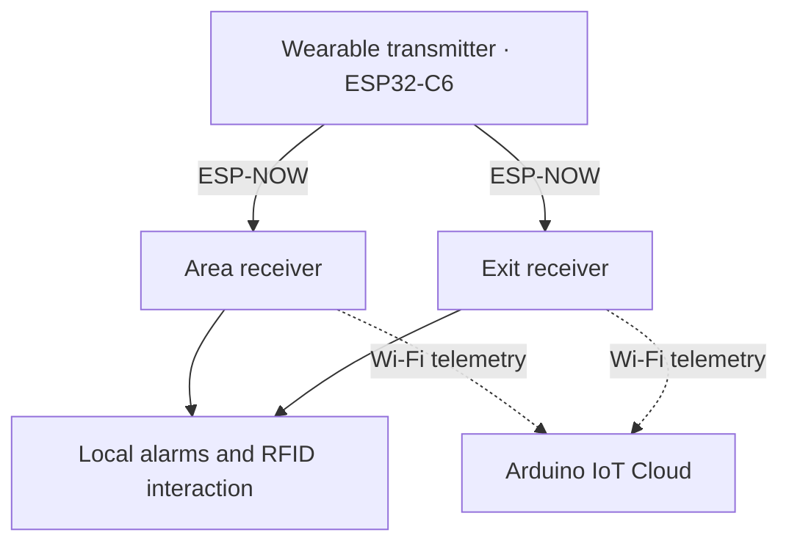

# MONITOR IoT

**Embedded Systems · IoT · PCB · Hardware/Firmware Integration**

[Español](README.md) · [Hardware REV 2.0](docs/hardware-rev2.md) · [Firmware](firmware/README.md) · [Validation status](docs/validation.md)

Wireless proximity monitoring and local alarms developed by **Luis Alejandro Pérez Sousa** during an engineering residency at Hospital General Dr. Desiderio G. Rosado Carbajal in Comalcalco, Mexico. A wearable transmitter and two receivers combine ESP-NOW, RSSI processing and RFID interaction.

**V1:** prototype built and evaluated during the residency. **REV 2.0:** receiver redesign using a removable XIAO ESP32-S3 and a custom PCB; fabrication outputs exported, assembly and testing not yet evidenced.

<p align="center"></p>

*REV 2.0 design render from EasyEDA. The XIAO and external PN532 module are not shown installed. This is not a photograph of manufactured hardware.*

## Engineering contribution

- C++ firmware for three ESP32-C6 nodes, ESP-NOW communication, RSSI filtering with an EMA and area-node hysteresis.
- RFID integration over UART/I²C, OLED displays, indicators and local alarms; Arduino IoT Cloud telemetry in V1.
- Electronic design in EasyEDA and V1 enclosure design in SolidWorks.
- Evolution toward a two-layer receiver PCB with removable controller, battery interface and fabrication documentation.

**Technologies:** C++/Arduino, ESP32-C6, XIAO ESP32-S3, ESP-NOW, I²C, UART, GPIO, EasyEDA Pro and SolidWorks. [Requirements and evidence](docs/requirements.md).

## System architecture — V1



The area receiver detects departure and uses an RDM6300. The exit receiver detects approach and uses a PN532. Decisions run locally. The system monitors transmitter proximity, not mattress occupancy, falls or precise distance. [Architecture](docs/architecture.md) · [Communications](docs/communication.md).

## Hardware REV 2.0

Carrier PCB for a **removable XIAO ESP32-S3**, I²C OLED, RGB LED, BC547-driven buzzer, pushbutton and battery interface. A four-contact header connects an external PN532. Available outputs include top/bottom copper Gerbers, masks and drill files; renders show copper areas and vias.

The JLCPCB component matching export still has unresolved selections. This is not presented as validated hardware or a confirmed manufacturing order. [Design and pending checks](docs/hardware-rev2.md) · [Hardware files](hardware/rev2/README.md).

## Firmware

| V1 node | Published implementation |
|---|---|
| [Transmitter](firmware/transmitter/transmitter.ino) | Two ESP-NOW destinations and channel sweep 1–11 |
| [Area](firmware/area_node/area_node.ino) | EMA α = 0.20, −66/−59 dBm hysteresis, UART RFID and critical alarm |
| [Exit](firmware/exit_node/exit_node.ino) | Approach detection from −65 dBm, latched alarm and PN532 reset |

These sketches target **V1**; a tested XIAO port is not included. [Environment setup](docs/getting-started.md) · [Static review and limitations](docs/firmware-review.md).

## Engineering decisions

| Constraint | Decision and trade-off |
|---|---|
| Limited budget | Commercial modules and integrated radio; no unmeasured savings claim |
| RSSI variation | EMA and hysteresis; stability versus response time |
| Local alerting | Receiver-side processing; telemetry remains secondary |
| REV 2.0 receiver integration | Custom PCB and removable sockets; assembly and pin mapping require verification |

[Decisions and evidence](docs/design-decisions.md).

## Historical results — V1

| Metric | Residency report result |
|---|---:|
| Mean detection time | 2 s |
| Mean alarm activation time | 2.2 s |
| Reported maximum stable-RSSI distance range | 11–17 m |
| False alarms | 1 in 20 trials |
| Battery runtime | 4.9 h |

Source: final report, table 24, printed page 72. These historical aggregate results do not validate REV 2.0 or constitute medical certification. [Methods and limitations](docs/testing.md).


*Assembly documented during the residency. [Original photographs and gallery](docs/evidence.md).*

## Documentation and status

- [Validation by revision](docs/validation.md): available evidence and pending tests.
- [Hardware](hardware/README.md): historical V1 and REV 2.0 design outputs.
- [Firmware](firmware/README.md): node responsibilities, compatibility and reproduction.
- [Evidence](docs/evidence.md): photographs, CAD and renders with provenance.
- [Security](SECURITY.md): local configuration and historical credential exposure.

Detailed engineering documentation is in Spanish.

```text
firmware/          V1 sketches by node and example configuration
hardware/rev1/     Historical integration and documented connections
hardware/rev2/     Schematic, PCB, Gerbers and component matching
docs/              Architecture, decisions, tests and evidence
```

## Author

**Luis Alejandro Pérez Sousa** — Mechatronics Engineering, ITSC, Mexico. Firmware development, electronics and hardware–software integration. [GitHub](https://github.com/alx-sousa).
