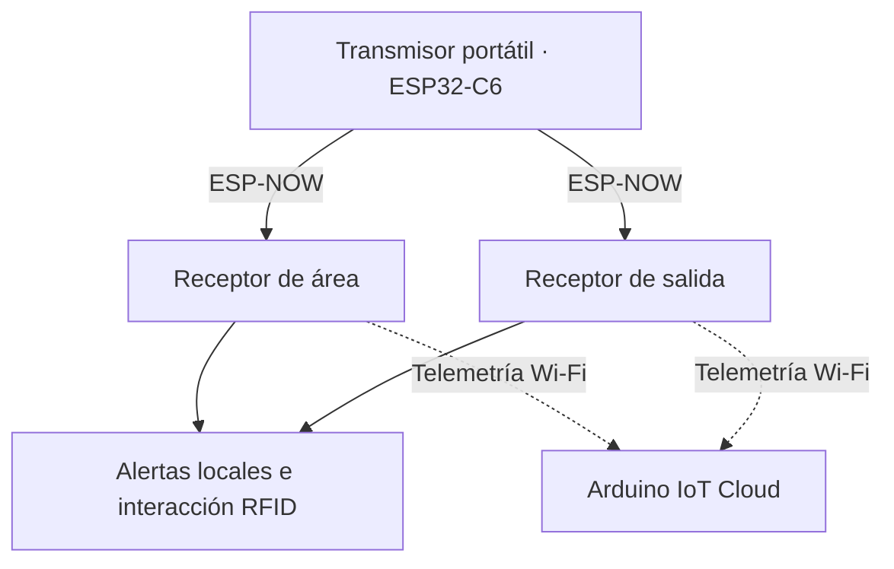

# MONITOR IoT

**Embedded Systems · IoT · PCB · Hardware/Firmware Integration**

[English](README.md) · [Hardware REV 2.0](docs/hardware-rev2.md) · [Firmware](firmware/README.md) · [Resultados y validación](docs/validation.md)

Sistema de proximidad inalámbrica y alarmas locales desarrollado por **Luis Alejandro Pérez Sousa** durante su residencia profesional en el Hospital General Dr. Desiderio G. Rosado Carbajal, Comalcalco, México. Un transmisor portátil y dos receptores combinan ESP-NOW, procesamiento RSSI e interacción RFID.

**V1:** prototipo construido y evaluado durante la residencia. **REV 2.0:** rediseño del receptor con XIAO ESP32-S3 y PCB propia; archivos de fabricación exportados, ensamble y pruebas pendientes de evidencia.

<p align="center"></p>

*Diseño de PCB REV 2.0. Render de EasyEDA; la XIAO y el módulo PN532 externo no aparecen montados. No es una fotografía de una placa fabricada.*

## Aportación de ingeniería

- Firmware C++ para tres nodos ESP32-C6, comunicación ESP-NOW y procesamiento RSSI mediante EMA e histéresis.
- Integración de RFID por UART/I²C, OLED, indicadores y alarmas locales; telemetría con Arduino IoT Cloud en V1.
- Diseño electrónico en EasyEDA y carcasas de V1 en SolidWorks.
- Evolución a una PCB de dos capas con controlador removible, interfaz de batería y documentación para preparar fabricación.

**Tecnologías:** C++/Arduino, ESP32-C6, XIAO ESP32-S3, ESP-NOW, I²C, UART, GPIO, EasyEDA Pro y SolidWorks. [Objetivos y evidencia](docs/requirements.md).

## Arquitectura del sistema — V1



El receptor de área detecta alejamiento e integra RDM6300; el de salida detecta aproximación e integra PN532. La decisión se ejecuta localmente. El sistema evalúa proximidad del transmisor: no mide ocupación del colchón, caídas ni distancia exacta. [Arquitectura](docs/architecture.md) · [Comunicaciones](docs/communication.md).

## Hardware REV 2.0

Carrier PCB para **XIAO ESP32-S3 removible**, OLED I²C, LED RGB, buzzer con BC547, pulsador e interfaz de batería. Un header de cuatro contactos conecta el PN532 externo. Incluye Gerbers de cobre superior/inferior, máscaras y taladros; los renders muestran zonas de cobre y vías.

La exportación para JLCPCB aún tiene selecciones de componentes pendientes. La PCB no se presenta como validada ni como pedido de fabricación confirmado. [Diseño y pendientes](docs/hardware-rev2.md) · [Archivos de hardware](hardware/rev2/README.md).

## Firmware

| Nodo V1 | Implementación publicada |
|---|---|
| [Transmisor](firmware/transmitter/transmitter.ino) | Dos destinos ESP-NOW y barrido de canales 1–11 |
| [Área](firmware/area_node/area_node.ino) | EMA α = 0.20, histéresis −66/−59 dBm, RFID UART y alarma crítica |
| [Salida](firmware/exit_node/exit_node.ino) | Detección desde −65 dBm, alarma enclavada y restablecimiento PN532 |

Los sketches corresponden a **V1**, no a un port ya validado en XIAO. [Preparación del entorno](docs/getting-started.md) · [Revisión estática y límites](docs/firmware-review.md).

## Decisiones de ingeniería

| Restricción | Decisión y compromiso |
|---|---|
| Presupuesto limitado | Módulos comerciales y radio integrada; sin afirmar ahorros no medidos |
| Variación de RSSI | EMA e histéresis; compromiso entre estabilidad y tiempo de respuesta |
| Alertamiento local | Procesamiento en receptores; la telemetría es una función secundaria |
| Integración del receptor REV 2.0 | PCB y sockets removibles; requiere comprobar montaje y correspondencia de pines |

[Decisiones y evidencia](docs/design-decisions.md).

## Resultados históricos — V1

| Indicador | Reportado en la residencia |
|---|---:|
| Detección promedio | 2 s |
| Activación de alarma promedio | 2.2 s |
| Rango reportado de máxima distancia con RSSI estable | 11–17 m |
| Falsas alarmas | 1 en 20 pruebas |
| Autonomía | 4.9 h |

Fuente: informe final, tabla 24, página impresa 72. Son resultados agregados históricos; no validan REV 2.0 ni equivalen a certificación médica. [Método y límites](docs/testing.md).


*Ensamble documentado durante la residencia. [Fotografías originales y galería](docs/evidence.md).*

## Documentación y estado

- [Validación por revisión](docs/validation.md): evidencia disponible y pruebas pendientes.
- [Hardware](hardware/README.md): V1 histórica y paquete REV 2.0.
- [Firmware](firmware/README.md): nodos, compatibilidad y reproducción.
- [Evidencia](docs/evidence.md): fotografías, CAD y renders con procedencia.
- [Seguridad](SECURITY.md): configuración local y exposición histórica de credenciales.

```text
firmware/          Sketches V1 por nodo y configuración de ejemplo
hardware/rev1/     Integración histórica y conexiones documentadas
hardware/rev2/     Esquema, PCB, Gerbers y selección de componentes
docs/              Arquitectura, decisiones, pruebas y evidencia
```

## Autor

**Luis Alejandro Pérez Sousa** — Ingeniería Mecatrónica, ITSC, México. Desarrollo de firmware, electrónica e integración hardware–software. [GitHub](https://github.com/alx-sousa).
