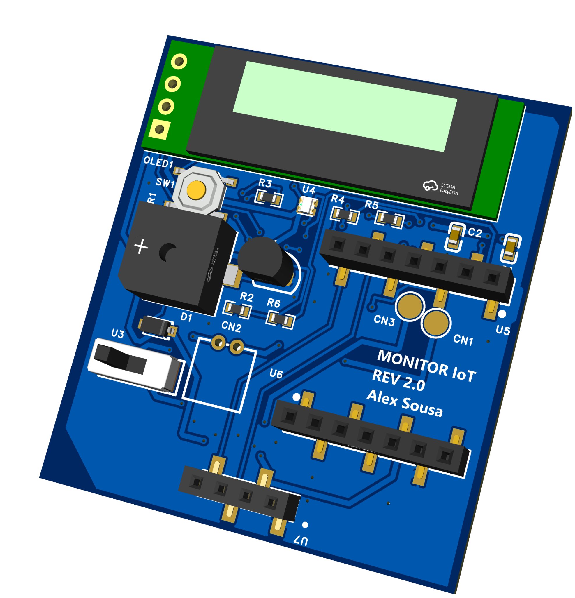
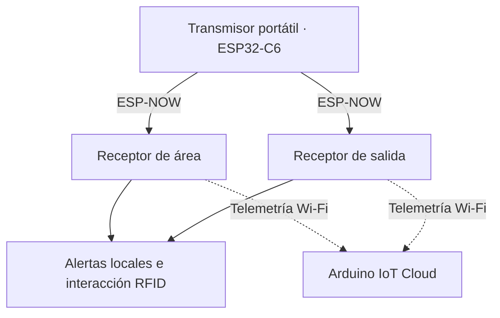

# MONITOR IoT

**Embedded Systems · IoT · PCB · Hardware/Firmware Integration**

[English](README.md) · [Hardware REV 2.0](docs/hardware-rev2.md) · [Firmware](firmware/README.md) · [Resultados y validación](docs/validation.md)

Sistema inalámbrico de monitoreo de proximidad y alarmas locales desarrollado durante una residencia profesional en el Hospital General Dr. Desiderio G. Rosado Carbajal, Comalcalco, México.

**Líder del proyecto y colaborador en sistemas embebidos/hardware:** **Luis Alejandro Pérez Sousa**.

**V1:** prototipo financiado por el equipo, construido y evaluado durante la residencia. **REV 2.0:** rediseño posterior del receptor iniciado a partir de una solicitud de mejora, con XIAO ESP32-S3 removible y PCB propia de dos capas. Los archivos de fabricación están disponibles; el ensamble, bring-up y validación física siguen pendientes.

<p align="center"></p>

*Diseño de PCB REV 2.0. Render de EasyEDA; la XIAO y el módulo PN532 externo no aparecen montados. No es una fotografía de una placa fabricada.*

## Evolución del proyecto y liderazgo

V1 se desarrolló con un presupuesto limitado y los gastos del prototipo fueron cubiertos por el equipo. Lideré la coordinación de tareas, la integración del sistema embebido, las pruebas y la documentación técnica. El equipo completó el prototipo V1, su evaluación experimental y los entregables de la residencia.

REV 2.0 responde a una **solicitud posterior de mejora**. El rediseño busca reducir cableado punto a punto, mejorar mantenibilidad, compactar el receptor y generar un paquete de fabricación más limpio. Es una evolución de ingeniería del concepto V1; no se presenta como hardware ya fabricado o validado.

## Mi aportación de ingeniería

- Liderazgo y coordinación técnica del equipo durante integración, pruebas y documentación.
- Firmware C++ para tres nodos ESP32-C6, comunicación ESP-NOW y procesamiento RSSI mediante EMA e histéresis.
- Integración de RFID por UART/I²C, OLED, indicadores y alarmas locales; telemetría con Arduino IoT Cloud en V1.
- Diseño electrónico en EasyEDA y participación en el desarrollo de carcasas V1 en SolidWorks.
- Evolución del receptor a una PCB de dos capas con controlador removible, interfaz de batería y documentación de fabricación.
- Revisión técnica para separar resultados medidos de V1, comportamiento del código y verificaciones pendientes de REV 2.0.

**Tecnologías:** C++/Arduino, ESP32-C6, XIAO ESP32-S3, ESP-NOW, I²C, UART, GPIO, EasyEDA Pro, SolidWorks y Arduino IoT Cloud. [Objetivos y evidencia](docs/requirements.md).

## Arquitectura del sistema — V1



El receptor de área detecta alejamiento e integra RDM6300; el de salida detecta aproximación e integra PN532. La decisión se ejecuta localmente. El sistema evalúa proximidad del transmisor: no mide ocupación del colchón, caídas ni distancia exacta. [Arquitectura](docs/architecture.md) · [Comunicaciones](docs/communication.md).

## Hardware REV 2.0

Carrier PCB para **XIAO ESP32-S3 removible**, OLED I²C, LED RGB, buzzer con BC547, pulsador e interfaz de batería. Un header de cuatro contactos conecta el PN532 externo. Incluye Gerbers de cobre superior/inferior, máscaras y taladros.

La exportación para JLCPCB aún tiene selecciones de componentes pendientes. El diseño se documenta como **pre-fabricación / pre-bring-up**, no como hardware eléctricamente validado ni como pedido de producción confirmado. [Diseño y pendientes](docs/hardware-rev2.md) · [Archivos de hardware](hardware/rev2/README.md).

## Firmware

| Nodo V1 | Implementación publicada |
|---|---|
| [Transmisor](firmware/transmitter/transmitter.ino) | Dos destinos ESP-NOW y barrido de canales 1–11 |
| [Área](firmware/area_node/area_node.ino) | EMA α = 0.20, histéresis −66/−59 dBm, RFID UART y alarma crítica |
| [Salida](firmware/exit_node/exit_node.ino) | Detección desde −65 dBm, alarma enclavada y restablecimiento PN532 |

Los sketches corresponden a **V1**. Los comentarios del código se mantienen en inglés para facilitar revisión técnica; la lógica histórica y los mensajes visibles al operador se preservan sin cambios. Aún no existe un port validado para XIAO ESP32-S3. [Preparación del entorno](docs/getting-started.md) · [Revisión estática](docs/firmware-review.md).

## Decisiones de ingeniería

| Restricción | Decisión y compromiso |
|---|---|
| Presupuesto V1 cubierto por el equipo | Módulos comerciales y radio integrada mantuvieron viable el prototipo; no se afirma ahorro ni ROI sin medición |
| Variación de RSSI | EMA e histéresis; compromiso entre estabilidad y tiempo de respuesta |
| Alertamiento local | Procesamiento en receptores; la telemetría es secundaria |
| Solicitud de mejora REV 2.0 | PCB propia y sockets removibles para una integración más limpia y mantenible; ensamble, pin mapping y port de firmware siguen por verificar |

[Decisiones y evidencia](docs/design-decisions.md).

## Resultados históricos — V1

| Indicador | Reportado en la residencia |
|---|---:|
| Detección promedio | 2 s |
| Activación de alarma promedio | 2.2 s |
| Rango reportado de máxima distancia con RSSI estable | 11–17 m |
| Falsas alarmas | 1 en 20 pruebas |
| Autonomía | 4.9 h |

Fuente: informe final, tabla 24, página impresa 72. Son resultados agregados históricos; no validan REV 2.0 ni equivalen a certificación médica. [Método y límites](docs/testing.md).

Las fotografías históricas de V1 y figuras del informe se conservan en la [galería de evidencia](docs/evidence.md) para trazabilidad. Las imágenes internas con placa de prototipado no se usan como imagen principal del portafolio; esta página prioriza el trabajo actual de REV 2.0.

## Documentación y estado

- [Validación por revisión](docs/validation.md): evidencia disponible y pruebas pendientes.
- [Hardware](hardware/README.md): V1 histórica y paquete REV 2.0.
- [Firmware](firmware/README.md): nodos, compatibilidad y reproducción.
- [Evidencia](docs/evidence.md): fotografías, CAD y renders con procedencia.
- [Seguridad](SECURITY.md): configuración local y exposición histórica de credenciales.

```text
firmware/          Sketches V1 por nodo y configuración de ejemplo
hardware/rev1/     Integración histórica y conexiones documentadas
hardware/rev2/     Esquema, PCB, Gerbers y selección de componentes
docs/              Arquitectura, decisiones, pruebas y evidencia
```

## Autor

**Luis Alejandro Pérez Sousa** — Ingeniería Mecatrónica, ITSC, México. Liderazgo de proyecto, firmware embebido, electrónica, diseño PCB e integración hardware–software. [GitHub](https://github.com/alx-sousa).
