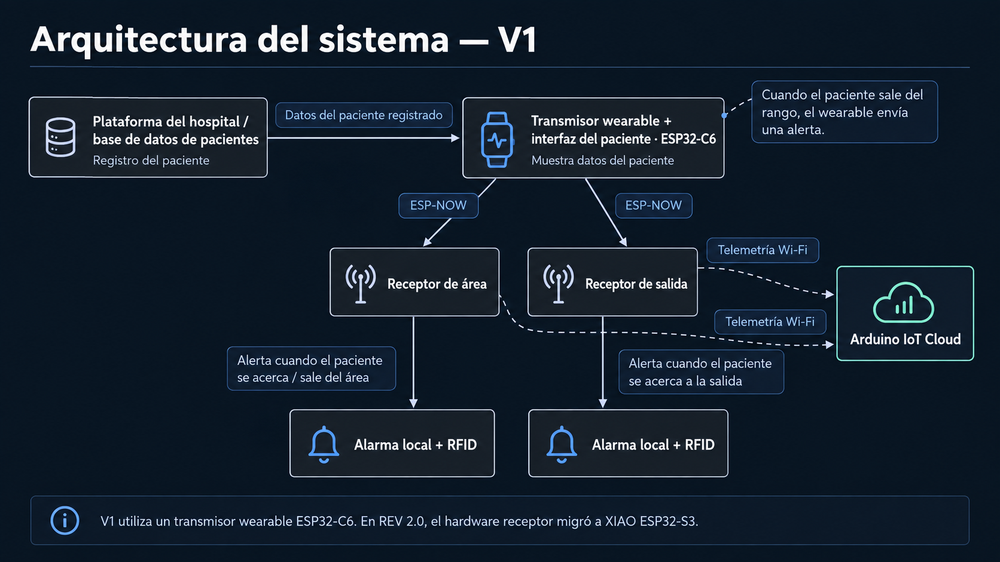

# Autonomous IoT Monitoring

**Embedded Systems · IoT · PCB · Hardware/Firmware Integration**

[English](README.md) · [Hardware REV 2.0](docs/hardware-rev2.md) · [Firmware](firmware/README.md) · [Resultados y validación](docs/validation.md)

Sistema inalámbrico de monitoreo de proximidad y alarmas locales desarrollado a partir de una solicitud técnica del departamento de DTI del Hospital General Dr. Desiderio G. Rosado Carbajal, Comalcalco, México.

**Líder del proyecto y colaborador en sistemas embebidos/hardware:** **Luis Alejandro Pérez Sousa**.

**V1:** sistema funcional desarrollado, probado y entregado al hospital por el equipo del proyecto. **REV 2.0:** rediseño de ingeniería independiente desarrollado después de la entrega e informado por solicitudes posteriores de mejora, con XIAO ESP32-S3 removible, PCB propia de dos capas y CAD de carcasa completado.

### Transmisor wearable — interfaz del paciente

El transmisor wearable combina el enlace inalámbrico del paciente con una interfaz integrada. Después de que enfermería registra al paciente en la plataforma/base de datos del hospital, la información asociada puede mostrarse directamente en el reloj mientras el dispositivo se comunica con los receptores para el monitoreo de proximidad y las alertas locales.

<p align="center"></p>

*Transmisor wearable V1 con interfaz integrada del paciente.*

<p align="center"></p>

*Diseño de PCB REV 2.0 en EasyEDA Pro.*

### Integración mecánica REV 2.0 — Fusion 360

REV 2.0 avanzó del layout de PCB a la integración mecánica en **Fusion 360**, reuniendo la PCB carrier, los módulos removibles y la carcasa en un mismo ensamble. La **XIAO ESP32-S3** y el módulo **PN532 RFID externo** se mantienen removibles mediante headers hembra para facilitar mantenimiento, reutilización y depuración, preservando además el acceso USB-C, el despeje de antena y el ajuste con la carcasa.

<p align="center"></p>

*Ensamble en Fusion 360 utilizado para revisar colocación de módulos, mantenibilidad e integración con la carcasa antes de fabricar.*

### CAD de carcasa REV 2.0 — completado

El CAD final de la carcasa consolida la PCB carrier, la **XIAO ESP32-S3 removible**, el módulo **PN532** externo y la geometría de la carcasa en el diseño mecánico completo de REV 2.0.

<p align="center"></p>

*Vista final del CAD de carcasa REV 2.0 en Fusion 360.*

[Notas de integración mecánica](docs/hardware-rev2.md#fusion-360-mechanical-assembly).

## Evolución del proyecto y liderazgo

El departamento de DTI del hospital solicitó un sistema de monitoreo con conectividad inalámbrica y alarmas locales. Coordiné al equipo durante la integración del sistema embebido, las pruebas y la documentación técnica hasta evaluar y entregar V1.

Después de la entrega continué el proyecto de forma independiente mediante REV 2.0, incorporando una **solicitud posterior de mejora** orientada a reducir cableado punto a punto, mejorar mantenibilidad, compactar el receptor y preparar un paquete de fabricación más limpio.

## Mi aportación de ingeniería

- Liderazgo y coordinación técnica del equipo durante integración, pruebas y documentación.
- Firmware C++ para tres nodos ESP32-C6, comunicación ESP-NOW y procesamiento RSSI mediante EMA e histéresis.
- Integración de RFID por UART/I²C, OLED, indicadores y alarmas locales; telemetría con Arduino IoT Cloud en V1.
- Diseño electrónico en EasyEDA Pro y participación en el desarrollo de carcasas V1 en SolidWorks.
- Desarrollo de la integración mecánica y carcasa REV 2.0 en Fusion 360 alrededor de la PCB de dos capas, el controlador removible y la interfaz de batería.
- Revisión técnica para separar resultados medidos de V1, comportamiento del código y verificaciones pendientes de REV 2.0.

**Tecnologías:** C++/Arduino, ESP32-C6, XIAO ESP32-S3, ESP-NOW, I²C, UART, GPIO, EasyEDA Pro, Fusion 360, SolidWorks y Arduino IoT Cloud. [Objetivos y evidencia](docs/requirements.md).

## Arquitectura del sistema — V1

<p align="center"></p>

V1 utiliza un **transmisor wearable ESP32-C6** con interfaz integrada para el paciente. La información se registra desde la plataforma/base de datos del hospital y se asocia al wearable, donde puede mostrarse localmente.

El wearable se comunica de forma **independiente** con el receptor de área y el receptor de salida mediante ESP-NOW. Los receptores **no intercambian datos ni se sincronizan entre sí**. Cada nodo evalúa localmente la señal del transmisor: el receptor de área detecta la salida de la zona monitoreada y el receptor de salida detecta la aproximación a la salida. Cuando se cumple su condición, el nodo correspondiente activa su propia alarma local visual/sonora y la interacción RFID. Arduino IoT Cloud se utilizó como una capa separada de telemetría.

El sistema evalúa proximidad del transmisor; no mide ocupación del colchón, caídas ni distancia exacta. [Arquitectura](docs/architecture.md) · [Comunicaciones](docs/communication.md).

## Hardware REV 2.0

Carrier PCB para **XIAO ESP32-S3 removible**, OLED I²C, LED RGB, buzzer con BC547, pulsador e interfaz de batería. Un header de cuatro contactos conecta el PN532 externo. Incluye Gerbers de cobre superior/inferior, máscaras y taladros.

La exportación para JLCPCB aún tiene selecciones de componentes pendientes. El paquete de diseño REV 2.0 está completo para la etapa actual y preparado para la siguiente fase de fabricación y bring-up. [Diseño y pendientes](docs/hardware-rev2.md) · [Archivos de hardware](hardware/rev2/README.md).

## Firmware

| Nodo V1 | Implementación publicada |
|---|---|
| [Transmisor](firmware/transmitter/transmitter.ino) | Dos destinos ESP-NOW y barrido de canales 1–11 |
| [Área](firmware/area_node/area_node.ino) | EMA α = 0.20, histéresis −66/−59 dBm, RFID UART y alarma crítica |
| [Salida](firmware/exit_node/exit_node.ino) | Detección desde −65 dBm, alarma enclavada y restablecimiento PN532 |

Los sketches corresponden a **V1**. Los comentarios del código se mantienen en inglés para facilitar revisión técnica; la lógica histórica y los mensajes visibles al operador se preservan sin cambios. Aún no existe un port validado para XIAO ESP32-S3. [Preparación del entorno](docs/getting-started.md) · [Revisión estática](docs/firmware-review.md).

## Decisiones de ingeniería

| Restricción | Decisión y compromiso |
|---|---|
| Presupuesto V1 cubierto por el equipo | Módulos comerciales y radio integrada mantuvieron viable el prototipo; no se afirma ahorro ni ROI sin medición |
| Variación de RSSI | EMA e histéresis; compromiso entre estabilidad y tiempo de respuesta |
| Alertamiento local | Procesamiento en receptores; la telemetría es secundaria |
| Solicitud de mejora REV 2.0 | PCB propia y sockets removibles para una integración más limpia y mantenible; ensamble, pin mapping y port de firmware siguen por verificar |

[Decisiones y evidencia](docs/design-decisions.md).

## Resultados históricos — V1

| Indicador | Resultado del informe de validación V1 |
|---|---:|
| Detección promedio | 2 s |
| Activación de alarma promedio | 2.2 s |
| Rango reportado de máxima distancia con RSSI estable | 11–17 m |
| Falsas alarmas | 1 en 20 pruebas |
| Autonomía | 4.9 h |

Fuente: informe técnico final de V1, tabla 24, página impresa 72. Son resultados agregados históricos; no validan REV 2.0 ni equivalen a certificación médica. [Método y límites](docs/testing.md).

Las fotografías históricas de V1 y figuras del informe se conservan en la [galería de evidencia](docs/evidence.md) para trazabilidad. Las imágenes internas con placa de prototipado no se usan como imagen principal del portafolio; esta página prioriza el trabajo actual de REV 2.0.

## Documentación y estado

- [Validación por revisión](docs/validation.md): evidencia disponible y pruebas pendientes.
- [Hardware](hardware/README.md): V1 histórica y paquete REV 2.0.
- [Firmware](firmware/README.md): nodos, compatibilidad y reproducción.
- [Evidencia](docs/evidence.md): fotografías, CAD y renders con procedencia.
- [Seguridad](SECURITY.md): configuración local y exposición histórica de credenciales.

```text
firmware/          Sketches V1 por nodo y configuración de ejemplo
hardware/rev1/     Integración histórica y conexiones documentadas
hardware/rev2/     Esquema, PCB, Gerbers y selección de componentes
docs/              Arquitectura, decisiones, pruebas y evidencia
```

## Autor

**Luis Alejandro Pérez Sousa** — Ingeniería Mecatrónica, ITSC, México. Liderazgo de proyecto, firmware embebido, electrónica, diseño PCB e integración hardware–software. [GitHub](https://github.com/alx-sousa).
