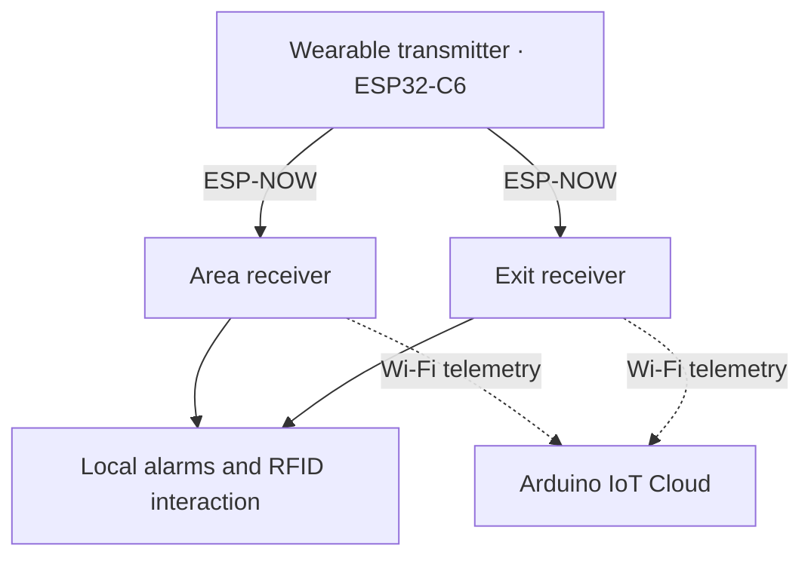

# Autonomous IoT Monitoring

**Embedded Systems · IoT · PCB Design · Hardware/Firmware Integration**

[Español](README.es.md) · [Hardware REV 2.0](docs/hardware-rev2.md) · [Firmware](firmware/README.md) · [Validation](docs/validation.md)

Wireless proximity monitoring and local alarm system developed in response to a technical request from the DTI department of Hospital General Dr. Desiderio G. Rosado Carbajal in Comalcalco, Mexico.

**Project lead and embedded/hardware contributor:** **Luis Alejandro Pérez Sousa**.

**V1:** functional prototype developed, tested and delivered to the hospital by the project team. **REV 2.0:** independent follow-up receiver redesign maintained after project delivery and informed by later improvement requests, using a removable XIAO ESP32-S3 and a custom two-layer PCB. Fabrication outputs are available; assembly, bring-up and physical validation remain pending.

<p align="center"></p>

*REV 2.0 EasyEDA render. The XIAO and external PN532 module are not shown installed. This is not a photograph of manufactured hardware.*

### REV 2.0 mechanical integration — Fusion 360

REV 2.0 has moved from PCB layout into mechanical integration. I assembled the board with 3D reference models in **Fusion 360** to review fit, serviceability and enclosure interfaces before fabrication.

The **XIAO ESP32-S3** and external **PN532 RFID module** remain removable through female headers rather than being permanently soldered. This supports replacement, reuse and easier debugging during development. The assembly is also being used to verify XIAO USB-C access, antenna clearance, PN532 placement and the relationship between the PCB and enclosure.

This CAD assembly is a mechanical design check, not proof of physical fit or electrical validation. Physical tolerances, assembly and bring-up remain pending. [Mechanical integration notes](docs/hardware-rev2.md#fusion-360-mechanical-assembly).

## Project evolution and leadership

The hospital's DTI department requested a functional monitoring device with wireless connectivity and local alarms. I coordinated the project team through task execution, embedded-system integration, testing and technical documentation. The team completed the V1 prototype, evaluated its operation and delivered the system to the hospital.

After V1 delivery, I continued the project through independent engineering updates. REV 2.0 incorporates a **follow-up improvement request** and focuses on reducing point-to-point wiring, improving maintainability, making the receiver more compact and producing a cleaner fabrication package. It is an engineering evolution of the delivered V1 prototype, not a claim that the new hardware has already been fabricated or validated.

## My engineering contribution

- Led project coordination and technical integration across firmware, electronics, enclosure work and validation activities.
- Developed C++ firmware for three ESP32-C6 nodes, ESP-NOW communication and RSSI processing with EMA filtering and hysteresis.
- Integrated RFID over UART/I²C, OLED interfaces, indicators and local alarms; Arduino IoT Cloud telemetry was used in V1.
- Designed electronics in EasyEDA and contributed to V1 enclosure development in SolidWorks.
- Evolved the receiver toward a compact two-layer PCB with removable controller, battery interface and fabrication documentation.
- Reviewed the published implementation to separate measured V1 results, source-code behavior and pending REV 2.0 verification.

**Technologies:** C++/Arduino, ESP32-C6, XIAO ESP32-S3, ESP-NOW, I²C, UART, GPIO, EasyEDA Pro, SolidWorks and Arduino IoT Cloud. [Requirements and evidence](docs/requirements.md).

## System architecture — V1



The area receiver detects departure and uses an RDM6300 reader. The exit receiver detects approach and uses a PN532. Decisions are executed locally on the receivers. The system monitors transmitter proximity; it does **not** measure mattress occupancy, detect falls or estimate exact distance. [Architecture](docs/architecture.md) · [Communications](docs/communication.md).

## Hardware REV 2.0

Carrier PCB for a **removable XIAO ESP32-S3**, I²C OLED, RGB LED, BC547-driven buzzer, pushbutton and battery interface. A four-contact header connects the external PN532. Available fabrication outputs include copper, solder mask and drill files.

The JLCPCB component-matching export still contains unresolved selections. The design is therefore documented as **pre-fabrication / pre-bring-up**, not as electrically validated hardware or a confirmed production order. [Design and pending checks](docs/hardware-rev2.md) · [Hardware files](hardware/rev2/README.md).

## Firmware

| V1 node | Published implementation |
|---|---|
| [Transmitter](firmware/transmitter/transmitter.ino) | Two ESP-NOW destinations and channel sweep 1–11 |
| [Area receiver](firmware/area_node/area_node.ino) | EMA α = 0.20, −66/−59 dBm hysteresis, UART RFID and critical alarm logic |
| [Exit receiver](firmware/exit_node/exit_node.ino) | Approach detection from −65 dBm, latched alarm and PN532 reset |

These sketches target **V1**. Their comments are written for engineering readability, while the historical control logic and operator-facing messages remain unchanged. A tested XIAO ESP32-S3 port is not included yet. [Environment setup](docs/getting-started.md) · [Static firmware review](docs/firmware-review.md).

## Engineering decisions

| Constraint | Decision and trade-off |
|---|---|
| Team-funded V1 budget | Commercial modules and integrated radio kept the prototype achievable; no unmeasured savings or ROI claim is made |
| RSSI variation | EMA and hysteresis; improved stability at the cost of response delay |
| Local alerting | Receiver-side decisions; cloud telemetry remains secondary |
| REV 2.0 improvement request | Custom PCB and removable sockets target cleaner integration and maintainability; assembly, pin mapping and firmware port still require verification |

[Engineering decisions and evidence](docs/design-decisions.md).

## Historical results — V1

| Metric | V1 validation report result |
|---|---:|
| Mean detection time | 2 s |
| Mean alarm activation time | 2.2 s |
| Reported maximum stable-RSSI distance range | 11–17 m |
| False alarms | 1 in 20 trials |
| Battery runtime | 4.9 h |

Source: final V1 technical report, table 24, printed page 72. These are historical aggregate results from V1; they do not validate REV 2.0 and do not constitute medical certification. [Methods and limitations](docs/testing.md).

Historical V1 photographs and report figures remain available in the [evidence gallery](docs/evidence.md) for traceability. Internal prototyping-board photographs are intentionally not used as the main portfolio image; this landing page emphasizes the current REV 2.0 engineering work.

## Repository map

```text
firmware/          V1 sketches by node and example secret configuration
hardware/rev1/     Historical V1 integration and documented interfaces
hardware/rev2/     REV 2.0 schematic, PCB, Gerbers and component matching
docs/              Architecture, decisions, testing, validation and evidence
```

- [Validation by revision](docs/validation.md): evidence available and tests still pending.
- [Hardware overview](hardware/README.md): V1 history and REV 2.0 deliverables.
- [Firmware overview](firmware/README.md): node responsibilities and reproduction notes.
- [Security](SECURITY.md): local secret handling and historical credential exposure.

## Author

**Luis Alejandro Pérez Sousa** — Mechatronics Engineering, ITSC, Mexico. Project leadership, embedded firmware, electronics, PCB design and hardware–software integration. [GitHub profile](https://github.com/alx-sousa).
