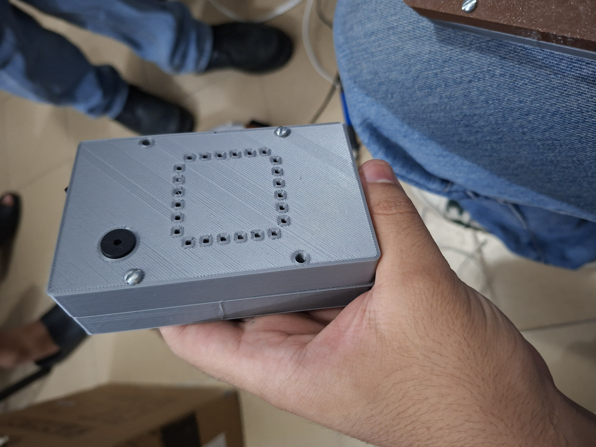
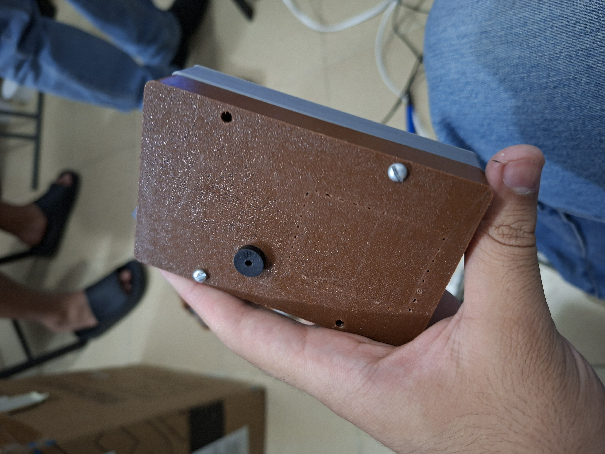
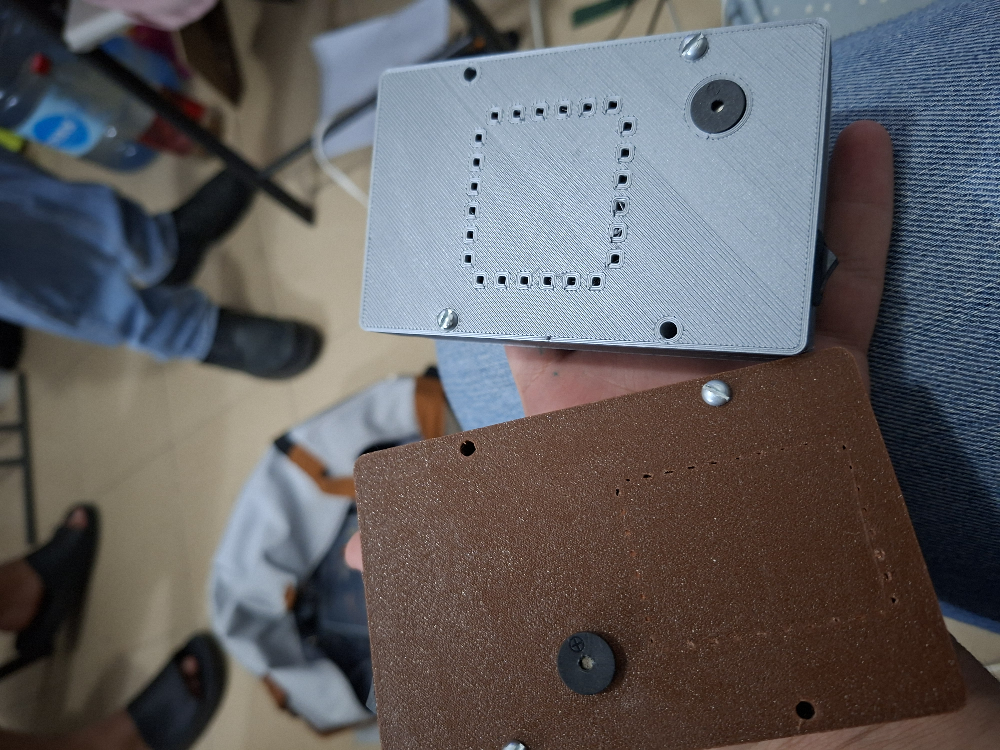
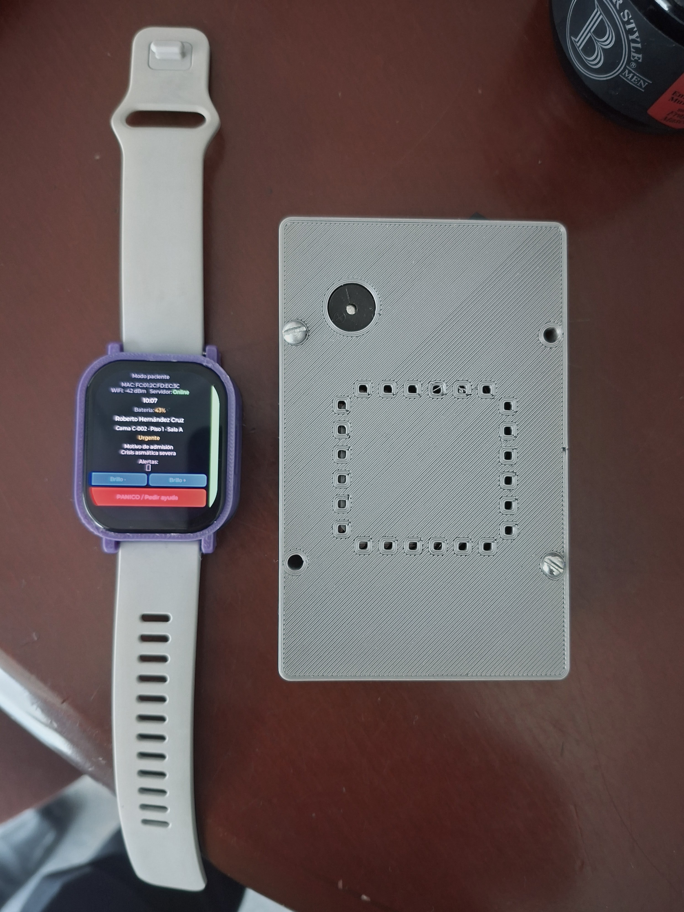

# Monitoreo de proximidad y alarma local hospitalaria | V1

**ESP32-C6 · C++/Arduino · ESP-NOW · RSSI/EMA · RFID · Integración electrónica y CAD**

[English](README.en.md) · [Arquitectura](docs/architecture.md) · [Resultados](docs/testing.md) · [Puesta en marcha](docs/getting-started.md) · [Evidencia visual](docs/evidence.md)

Prototipo de sistemas embebidos e IoT desarrollado por **Luis Alejandro Pérez Sousa** durante su residencia profesional en el **Hospital General Dr. Desiderio G. Rosado Carbajal**, Comalcalco, Tabasco. Integra un transmisor portátil y dos receptores para evaluar proximidad y generar alertas locales ante alejamiento del área de camilla o aproximación a una salida.

La V1 reúne firmware de tres nodos, integración electrónica, diseño de carcasas y evaluación experimental. La lógica de detección se ejecuta en los microcontroladores; Arduino IoT Cloud aporta telemetría secundaria. Es un **prototipo de residencia**, sin certificación médica ni validación clínica.

## Prototipo construido

  
  
  

  

## Problema y alcance

El proyecto aborda la necesidad de complementar la supervisión de movilidad en el entorno hospitalario mediante avisos visuales y sonoros. El transmisor se lleva en formato brazalete; los receptores evalúan su señal inalámbrica para identificar condiciones de proximidad configuradas.

El **bajo costo y el presupuesto limitado** fueron criterios de diseño: se aprovecharon módulos comerciales, la radio integrada del ESP32 y carcasas fabricadas mediante impresión 3D. El valor de ingeniería está en integrar estos recursos y evaluar sus compromisos. No se publica un ahorro porcentual ni un costo total sin una relación de compras verificable.

El sistema supervisa la proximidad del transmisor: no mide ocupación del colchón, no identifica una caída y no entrega distancia exacta en metros.

## Mi contribución técnica

- Desarrollo de firmware C++ para transmisión ESP-NOW, procesamiento RSSI e interacción local.
- Implementación de EMA, histéresis en el nodo de área y lógica de alarma diferenciada por nodo.
- Integración de lectores RFID mediante UART e I²C, pantallas OLED, LED y buzzer.
- Diseño electrónico en EasyEDA, ensamble de módulos y desarrollo de carcasas en SolidWorks.
- Integración de telemetría con Arduino IoT Cloud y evaluación funcional del prototipo.

La [matriz de objetivos y evidencia](docs/requirements.md) relaciona estas actividades con el informe y los archivos publicados.

## Arquitectura y decisiones

| Nodo | Función | Interfaces principales |
|---|---|---|
| Transmisor portátil | Envía a dos destinos y recorre canales 1–11 | ESP-NOW |
| Receptor de área | Evalúa alejamiento, modo paseo y condición crítica | RDM6300/UART, OLED/I²C, GPIO |
| Receptor de salida | Evalúa aproximación, activa alarma y permite restablecimiento RFID | PN532/I²C, OLED/I²C, GPIO |

Los receptores actualizan un filtro EMA con **α = 0.20** al recibir tramas. En área, los umbrales **−66/−59 dBm** introducen histéresis; la condición crítica usa **−84 dBm**. En salida, la alarma se activa desde **−65 dBm** y el restablecimiento RFID de una alarma activa inicia una exclusión de **6 s**.

Los contadores actuales evalúan ciclos del programa, no necesariamente paquetes nuevos. La lectura RFID permite interacción local, pero el código no compara identificadores contra una lista de usuarios autorizados. [Funcionamiento exacto](docs/communication.md) · [Decisiones y compromisos](docs/design-decisions.md).

## Resultados reportados

| Indicador | Resultado de la residencia |
|---|---:|
| Tiempo promedio de detección | 2 s |
| Tiempo promedio de activación de alarma | 2.2 s |
| Rango reportado de máxima distancia con RSSI estable | 11–17 m |
| Falsas alarmas | 1 en 20 pruebas |
| Autonomía con batería | 4.9 h |

Fuente: informe final, **tabla 24, página 72**. Son resultados históricos bajo las condiciones del prototipo; no constituyen garantías ni una nueva validación del firmware publicado. No se dispone aquí de registros crudos para recalcular promedios o intervalos de confianza. [Metodología, condiciones y límites](docs/testing.md).

## Del diseño a la integración

| Carcasa CAD | Ensamble del prototipo |
|---|---|
|  |  |

Figuras 17 y 28 del informe. La galería técnica incluye además telemetría y una vista del diseño PCB, identificada como referencia histórica: **los archivos de fabricación no están disponibles y la huella mostrada requiere conciliación con el C6 utilizado**. [Ver evidencia y procedencia](docs/evidence.md).

## Explorar y reproducir

| Recurso | Contenido |
|---|---|
| [Firmware](firmware/) | Sketches independientes y plantillas de credenciales |
| [Puesta en marcha](docs/getting-started.md) | Dependencias, configuración y comprobaciones de banco |
| [Hardware](hardware/README.md) | Componentes, GPIO y alcance de la documentación electrónica |
| [Revisión técnica](docs/firmware-review.md) | Diferencias entre informe y código; límites conocidos |
| [Seguridad](SECURITY.md) | Gestión de credenciales y alcance del prototipo |

Las versiones exactas del entorno original no quedaron fijadas. Esta revisión documental no incluye compilación ni pruebas físicas. Los detalles necesarios para repetirlas se explicitan en la guía de puesta en marcha.

## Autor

**Luis Alejandro Pérez Sousa** · Ingeniería Mecatrónica, ITSC  
Áreas de trabajo: firmware, sistemas embebidos, integración hardware–software e IoT.  
[Perfil de GitHub](https://github.com/alx-sousa)
