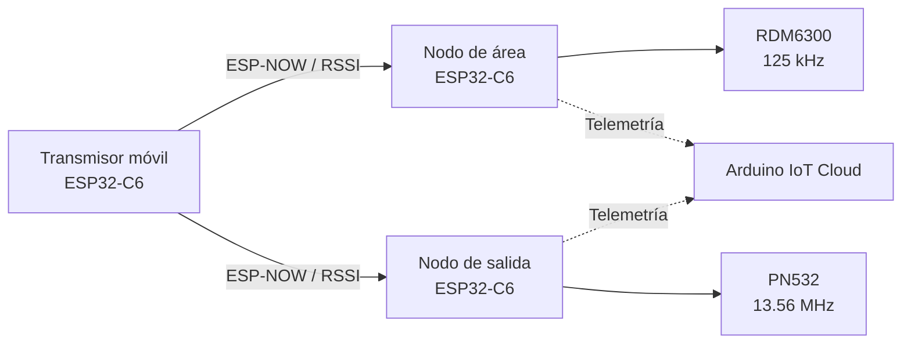

# Sistema de monitoreo de presencia y alerta local en camilla hospitalaria

Proyecto de **sistemas embebidos e IoT** desarrollado durante una residencia profesional de seis meses en el **Hospital General Dr. Desiderio G. Rosado Carbajal**, Comalcalco, Tabasco.

El prototipo integra **ESP32-C6, ESP-NOW, RFID, procesamiento de RSSI, PCB y Arduino IoT Cloud** en una arquitectura distribuida de tres nodos. La detección y las alertas se procesan localmente; la nube funciona como una capa secundaria de telemetría.

> **Seguridad:** las credenciales Wi-Fi y de Arduino IoT Cloud no se almacenan en el repositorio. Los receptores utilizan archivos locales `secrets.h`, excluidos mediante `.gitignore`.

## Qué hace el sistema

- Comunica un transmisor móvil con dos receptores mediante **ESP-NOW**.
- Utiliza **RSSI** como referencia de proximidad.
- Aplica filtro **EMA**, confirmación por lecturas consecutivas e histéresis.
- Integra identificación **RFID de 125 kHz y 13.56 MHz**.
- Ejecuta máquinas de estado y alertas directamente en los ESP32-C6.
- Proporciona indicación local mediante OLED, LED y buzzer.
- Publica variables de monitoreo mediante **Arduino IoT Cloud**.
- Funciona con alimentación portátil basada en LiPo.

## Arquitectura



La arquitectura completa y el flujo funcional están documentados en [docs/architecture.md](docs/architecture.md).

## Resultados del prototipo

Durante la evaluación experimental documentada en la residencia se obtuvieron los siguientes resultados:

| Prueba | Resultado reportado |
|---|---:|
| Tiempo promedio de detección | 2 s |
| Tiempo promedio de activación de alarma | 2.2 s |
| Distancia máxima con RSSI estable | 11–17 m |
| Falsas alarmas | 1 de 20 pruebas |
| Autonomía con batería | 4.9 h |

Estos valores corresponden a las condiciones experimentales del prototipo y no representan especificaciones universales. El comportamiento de RSSI depende del entorno, obstáculos y orientación de los dispositivos.

Detalles de metodología y validación: [docs/testing.md](docs/testing.md).

## Tecnologías

| Área | Tecnologías |
|---|---|
| Microcontrolador | ESP32-C6 |
| Firmware | C/C++ / Arduino |
| Comunicación | ESP-NOW, Wi-Fi |
| IoT | Arduino IoT Cloud |
| RFID | RDM6300, PN532 |
| Interfaz | OLED 128×64, LED RGB, buzzer |
| Procesamiento | RSSI, EMA, histéresis, máquina de estados |
| Diseño electrónico | PCB, EasyEDA |
| Alimentación | LiPo 3.7 V, TP4056, MT3608 |

## Hardware

### Nodo de área

| Componente | Interfaz / GPIO |
|---|---|
| RDM6300 | UART RX — GPIO17 |
| OLED | I²C — SDA GPIO7 / SCL GPIO6 |
| Buzzer | GPIO19 |
| LED RGB | GPIO14 / GPIO15 / GPIO18 |

### Nodo de salida

| Componente | Interfaz / GPIO |
|---|---|
| PN532 | I²C — SDA GPIO7 / SCL GPIO6 |
| OLED | I²C — SDA GPIO7 / SCL GPIO6 |
| LED de alarma | GPIO20 |
| Buzzer | GPIO19 |

BOM, alimentación e interfaces: [hardware/README.md](hardware/README.md).

## Firmware

El proyecto mantiene firmware independiente para cada responsabilidad:

- **Transmisor:** envío ESP-NOW y recorrido de canales.
- **Nodo de área:** RSSI, EMA, estados CERCA/LEJOS, RDM6300, OLED y alertas.
- **Nodo de salida:** RSSI, PN532, control de alarma y exclusión temporal tras autorización RFID.

La revisión técnica y las mejoras futuras identificadas están en [docs/firmware-review.md](docs/firmware-review.md).

## Estructura del repositorio

```text
Monitoreo-Camilla-IoT/
├── README.md
├── .gitignore
├── firmware/
│   ├── transmitter/
│   │   └── transmitter.ino
│   ├── area_node/
│   │   ├── area_node.ino
│   │   └── secrets.example.h
│   └── exit_node/
│       ├── exit_node.ino
│       └── secrets.example.h
├── hardware/
│   └── README.md
└── docs/
    ├── architecture.md
    ├── communication.md
    ├── firmware-review.md
    └── testing.md
```

## Documentación técnica

| Documento | Contenido |
|---|---|
| [Arquitectura](docs/architecture.md) | Nodos, flujo funcional y diseño general |
| [Comunicación y lógica](docs/communication.md) | ESP-NOW, RSSI, EMA, histéresis y RFID |
| [Pruebas y validación](docs/testing.md) | Metodología y resultados experimentales |
| [Hardware / BOM](hardware/README.md) | Componentes, alimentación, interfaces y GPIO |
| [Revisión del firmware](docs/firmware-review.md) | Implementación actual y mejoras futuras |

## Instalación

### Credenciales

En `firmware/area_node/` y `firmware/exit_node/`:

1. Copia `secrets.example.h`.
2. Renombra la copia a `secrets.h`.
3. Introduce las credenciales del dispositivo correspondiente.
4. Mantén `secrets.h` únicamente en el entorno local.

### Librerías

- ArduinoIoTCloud
- Arduino_ConnectionHandler
- Adafruit GFX Library
- Adafruit SSD1306
- Adafruit PN532

ESP-NOW, Wi-Fi y Wire forman parte del entorno ESP32.

### Carga

Cada sketch se compila y carga de forma independiente en el ESP32-C6 correspondiente.

## Participación en el proyecto

Durante la residencia profesional participé en el desarrollo e integración del sistema, incluyendo programación de ESP32-C6, comunicación ESP-NOW, procesamiento RSSI, integración RFID, diseño e integración de PCB, telemetría IoT y pruebas funcionales del prototipo.

## Limitaciones

- RSSI proporciona una referencia de proximidad, no una medición directa de distancia.
- Los umbrales requieren calibración según el entorno de instalación.
- La telemetría depende de la disponibilidad de Wi-Fi y del servicio IoT, mientras que la lógica principal se ejecuta localmente.
- El repositorio documenta un prototipo académico/profesional y no un dispositivo médico certificado.

## Autor

**Luis Alejandro Pérez Sousa**

Ingeniería en Mecatrónica · Electrónica · Sistemas embebidos · IoT · Automatización
