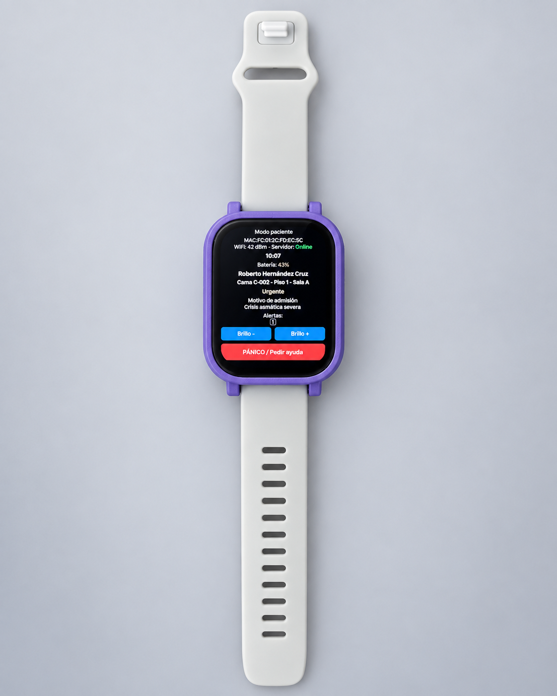
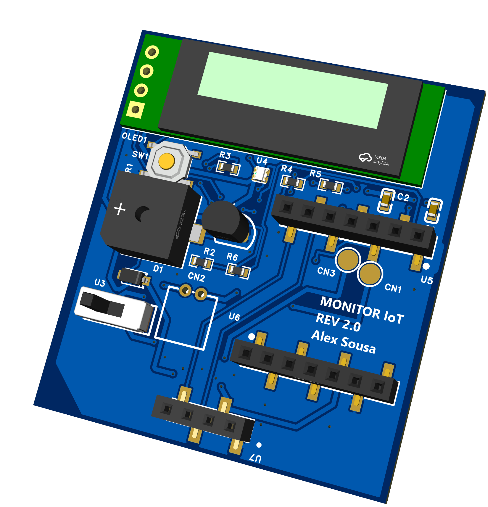
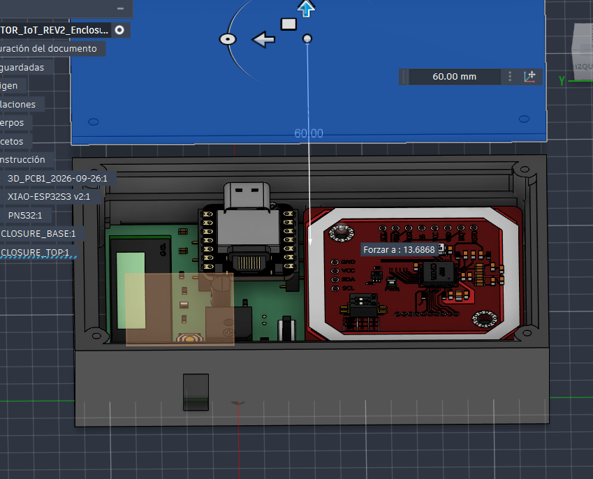
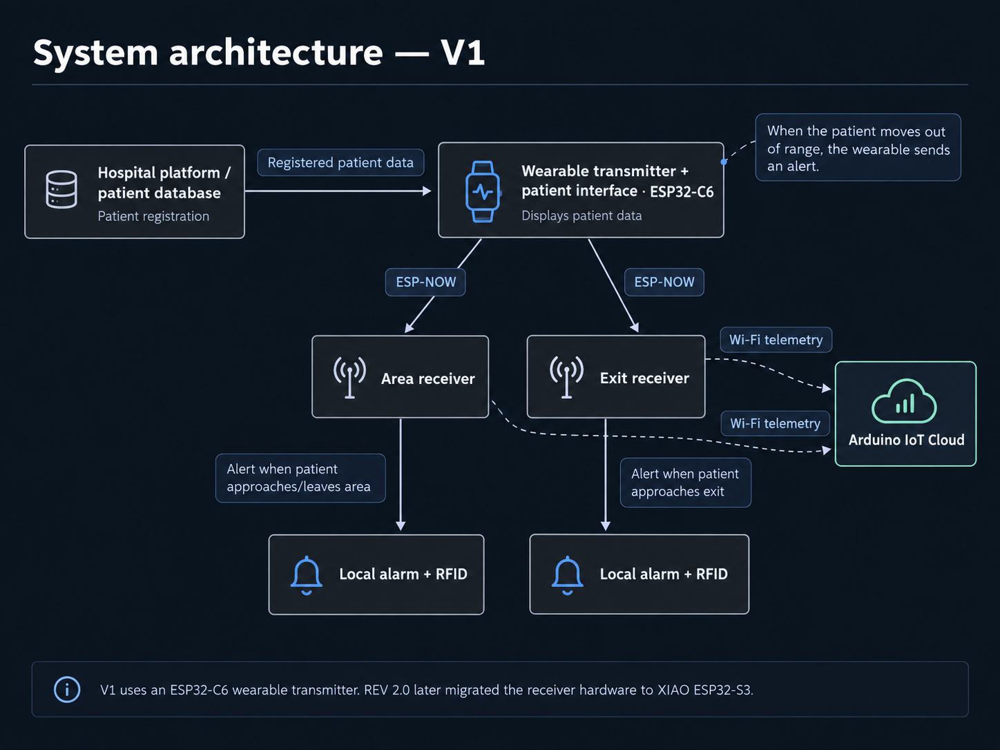

# Autonomous IoT Monitoring

**Embedded Systems · IoT · PCB Design · Hardware/Firmware Integration**

[Español](README.es.md) · [Hardware REV 2.0](docs/hardware-rev2.md) · [Firmware](firmware/README.md) · [Validation](docs/validation.md)

Wireless proximity monitoring and local alarm system developed in response to a technical request from the DTI department of Hospital General Dr. Desiderio G. Rosado Carbajal in Comalcalco, Mexico.

**Project lead and embedded/hardware contributor:** **Luis Alejandro Pérez Sousa**.

**V1:** functional system developed, tested and delivered to the hospital by the project team. **REV 2.0:** independent engineering redesign developed after project delivery and informed by later improvement requests, using a removable XIAO ESP32-S3, a custom two-layer PCB and a completed enclosure CAD.

### Wearable transmitter — patient interface

The wearable transmitter combines the patient-side radio link with an integrated interface. After nursing staff registers a patient in the hospital platform/database, the associated information can be displayed directly on the watch while the device communicates with the receiver nodes for proximity monitoring and local alerting.

<p align="center"></p>

*V1 wearable transmitter with integrated patient interface.*

<p align="center"></p>

*REV 2.0 PCB design in EasyEDA Pro.*

### REV 2.0 mechanical integration — Fusion 360

REV 2.0 progressed from PCB layout into mechanical integration in **Fusion 360**, bringing the carrier PCB, removable modules and enclosure into the same assembly. The **XIAO ESP32-S3** and external **PN532 RFID module** remain removable through female headers to support serviceability, reuse and debugging while preserving USB-C access, antenna clearance and enclosure fit.

<p align="center"></p>

*Fusion 360 assembly used to review module placement, serviceability and enclosure integration before fabrication.*

### REV 2.0 enclosure CAD — completed

The final enclosure CAD consolidates the carrier PCB, removable **XIAO ESP32-S3**, external **PN532** module and enclosure geometry into the completed REV 2.0 mechanical design.

<p align="center"></p>

*Final REV 2.0 enclosure CAD view in Fusion 360.*

[Mechanical integration notes](docs/hardware-rev2.md#fusion-360-mechanical-assembly) · [PCB & hardware portfolio](https://github.com/alx-sousa/PCB-Hardware-Portfolio).

## Project evolution and leadership

The hospital's DTI department requested a monitoring device with wireless connectivity and local alarms. I coordinated the team through embedded-system integration, testing and technical documentation until V1 was evaluated and delivered.

After delivery, I continued the project independently through REV 2.0, incorporating a **follow-up improvement request** focused on reducing point-to-point wiring, improving maintainability, compacting the receiver and preparing a cleaner fabrication package.

## My engineering contribution

- Led project coordination and technical integration across firmware, electronics, enclosure work and validation activities.
- Developed C++ firmware for three ESP32-C6 nodes, ESP-NOW communication and RSSI processing with EMA filtering and hysteresis.
- Integrated RFID over UART/I²C, OLED interfaces, indicators and local alarms; Arduino IoT Cloud telemetry was used in V1.
- Designed electronics in EasyEDA Pro and contributed to V1 enclosure development in SolidWorks.
- Developed REV 2.0 mechanical integration and enclosure CAD in Fusion 360 around the custom two-layer PCB, removable controller and battery interface.
- Reviewed the published implementation to separate measured V1 results, source-code behavior and pending REV 2.0 verification.

**Technologies:** C++/Arduino, ESP32-C6, XIAO ESP32-S3, ESP-NOW, I²C, UART, GPIO, EasyEDA Pro, Fusion 360, SolidWorks and Arduino IoT Cloud. [Requirements and evidence](docs/requirements.md).

## System architecture — V1

<p align="center"></p>

V1 uses an **ESP32-C6 wearable transmitter** with an integrated patient interface. Patient information is registered through the hospital platform/database and associated with the wearable, where it can be displayed locally.

The wearable communicates **independently** with the area receiver and exit receiver through ESP-NOW. The receiver nodes do **not** exchange data or synchronize with each other. Each node evaluates the transmitter locally: the area receiver detects departure from the monitored zone, while the exit receiver detects approach to the exit. When its condition is met, the corresponding node activates its own local audible/visual alarm and RFID interaction. Arduino IoT Cloud was used as a separate telemetry layer.

The system monitors transmitter proximity; it does **not** measure mattress occupancy, detect falls or estimate exact distance. [Architecture](docs/architecture.md) · [Communications](docs/communication.md).

## Hardware REV 2.0

Carrier PCB for a **removable XIAO ESP32-S3**, I²C OLED, RGB LED, BC547-driven buzzer, pushbutton and battery interface. A four-contact header connects the external PN532. Available fabrication outputs include copper, solder mask and drill files.

The JLCPCB component-matching export still contains unresolved selections. The REV 2.0 design package is complete for the current design stage and prepared for the next fabrication and bring-up phase. [Design and pending checks](docs/hardware-rev2.md) · [Hardware files](hardware/rev2/README.md).

## Firmware

| V1 node | Published implementation |
|---|---|
| [Transmitter](firmware/transmitter/transmitter.ino) | Two ESP-NOW destinations and channel sweep 1–11 |
| [Area receiver](firmware/area_node/area_node.ino) | EMA α = 0.20, −66/−59 dBm hysteresis, UART RFID and critical alarm logic |
| [Exit receiver](firmware/exit_node/exit_node.ino) | Approach detection from −65 dBm, latched alarm and PN532 reset |

These sketches target **V1**. Their comments are written for engineering readability, while the historical control logic and operator-facing messages remain unchanged. A tested XIAO ESP32-S3 port is not included yet. [Environment setup](docs/getting-started.md) · [Static firmware review](docs/firmware-review.md).

## Engineering decisions

| Constraint | Decision and trade-off |
|---|---|
| Team-funded V1 budget | Commercial modules and integrated radio kept the prototype achievable; no unmeasured savings or ROI claim is made |
| RSSI variation | EMA and hysteresis; improved stability at the cost of response delay |
| Local alerting | Receiver-side decisions; cloud telemetry remains secondary |
| REV 2.0 improvement request | Custom PCB and removable sockets target cleaner integration and maintainability; assembly, pin mapping and firmware port still require verification |

[Engineering decisions and evidence](docs/design-decisions.md).

## Historical results — V1

| Metric | V1 validation report result |
|---|---:|
| Mean detection time | 2 s |
| Mean alarm activation time | 2.2 s |
| Reported maximum stable-RSSI distance range | 11–17 m |
| False alarms | 1 in 20 trials |
| Battery runtime | 4.9 h |

Source: final V1 technical report, table 24, printed page 72. These are historical aggregate results from V1; they do not validate REV 2.0 and do not constitute medical certification. [Methods and limitations](docs/testing.md).

Historical V1 photographs and report figures remain available in the [evidence gallery](docs/evidence.md) for traceability. Internal prototyping-board photographs are intentionally not used as the main portfolio image; this landing page emphasizes the current REV 2.0 engineering work.

## Repository map

```text
firmware/          V1 sketches by node and example secret configuration
hardware/rev1/     Historical V1 integration and documented interfaces
hardware/rev2/     REV 2.0 schematic, PCB, Gerbers and component matching
docs/              Architecture, decisions, testing, validation and evidence
```

- [Validation by revision](docs/validation.md): evidence available and tests still pending.
- [Hardware overview](hardware/README.md): V1 history and REV 2.0 deliverables.
- [Firmware overview](firmware/README.md): node responsibilities and reproduction notes.
- [Security](SECURITY.md): local secret handling and historical credential exposure.

## Author

**Luis Alejandro Pérez Sousa** — Mechatronics Engineering, ITSC, Mexico. Project leadership, embedded firmware, electronics, PCB design and hardware–software integration. [GitHub profile](https://github.com/alx-sousa).
