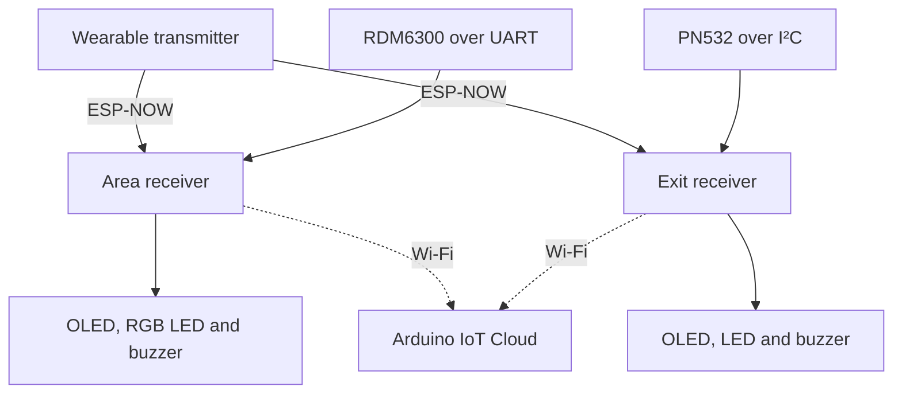

# V1 architecture

Three ESP32-C6 devices split the transmitter, area-monitoring and exit-monitoring responsibilities. RSSI from received ESP-NOW frames feeds local decisions. RFID is an interaction input; it is not the sensor used to estimate wearable proximity.

## Responsibility split

| Layer | Implementation |
|---|---|
| Transmission | One byte sent to two configured MAC destinations while sweeping channels 1–11 |
| Reception | ESP-NOW callback reads RSSI from `info->rx_ctrl` |
| Processing | Per-frame EMA; the latest filtered value is evaluated in `loop()` |
| Control | NEAR/FAR hysteresis and a critical condition on the area node; latched alarm and exclusion timer on the exit node |
| Interaction | RFID, OLED messages and digital outputs |
| Supervision | Read-only properties published to Arduino IoT Cloud |

## Local operation and cloud telemetry

The proximity and alert logic runs on the receivers. The final report, page 77, describes local alarm operation during simulated Wi-Fi loss. This should not be interpreted as guaranteed availability: the firmware still executes `ArduinoCloud.update()`, shares the radio between functions and does not implement an explicit no-packet timeout.

The report also describes a local IT-area server (§4.2.2). Its application and a specific interface to that server are not included in the published firmware, so it is not presented as a reproducible repository component.

## Artifacts

- [Firmware by node](../firmware/).
- [Hardware and interfaces](../hardware/README.md).
- [Communication logic and parameters](communication.md).
- [Physical integration and telemetry evidence](evidence.md).

## Receiver evolution

The architecture above corresponds to V1. [REV 2.0](hardware-rev2.md) redesigns the receiver around a XIAO ESP32-S3. Cloud connectivity and the V1 firmware are not claimed to be ported or validated on that revision.
