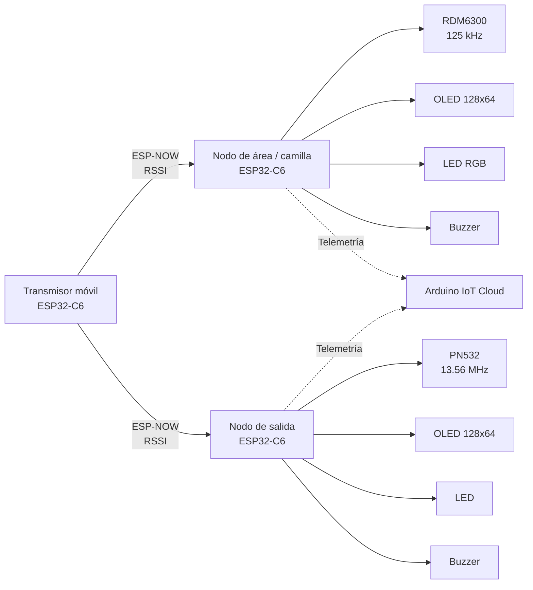

# Arquitectura del sistema

El sistema se organiza en tres nodos principales que intercambian información mediante **ESP-NOW**. La lógica de detección y generación de alertas se ejecuta localmente en los nodos receptores.

## Diagrama general

## Flujo funcional

### 1. Transmisor móvil

El transmisor utiliza un ESP32-C6 para emitir tramas mediante ESP-NOW. El firmware realiza cambios de canal para comunicarse con los nodos receptores.

### 2. Nodo de área / camilla

El nodo de área recibe las tramas del transmisor y utiliza el **RSSI** como referencia de proximidad.

Las lecturas son procesadas mediante un filtro EMA y una lógica de confirmación de estados. El nodo también integra un lector **RDM6300 de 125 kHz** para identificación RFID.

Cuando se cumplen las condiciones configuradas, el nodo genera indicaciones locales mediante OLED, LED y buzzer.

### 3. Nodo de salida

El nodo de salida recibe las transmisiones inalámbricas y procesa el RSSI para detectar una condición configurada de salida.

Integra un lector **PN532 de 13.56 MHz mediante I²C** para identificación RFID y gestión de una autorización. También dispone de OLED, LED y buzzer para la interacción local.

### 4. Telemetría IoT

Los nodos receptores pueden enviar variables de monitoreo a **Arduino IoT Cloud** mediante Wi-Fi.

La plataforma IoT funciona como canal secundario de visualización y telemetría. La lógica principal de detección y alerta permanece en los dispositivos locales.

## Principios de diseño

- **Procesamiento local:** las decisiones principales no dependen de la plataforma IoT.
- **Comunicación inalámbrica directa:** ESP-NOW permite la comunicación entre los nodos sin depender del servidor IoT para la detección.
- **Separación de funciones:** cada nodo tiene una responsabilidad definida.
- **Filtrado de señal:** el RSSI se procesa para reducir el efecto de fluctuaciones momentáneas.
- **Identificación por RFID:** se utilizan diferentes lectores según la función y ubicación del nodo.
