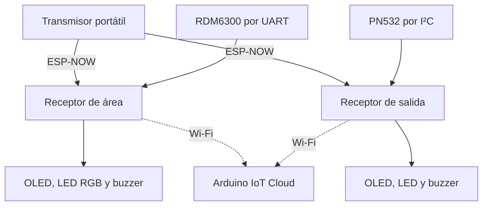

# Arquitectura de la V1

Tres ESP32-C6 distribuyen las tareas de transmisión, monitoreo de área y monitoreo de salida. La señal RSSI de las tramas recibidas alimenta las decisiones locales. RFID es una entrada de interacción, no el sensor que mide la proximidad del brazalete.

## Distribución de responsabilidades

| Capa | Implementación |
|---|---|
| Emisión | Un byte enviado a dos direcciones MAC configuradas, barrido de canales 1–11 |
| Recepción | Callback ESP-NOW obtiene RSSI de `info->rx_ctrl` |
| Procesamiento | EMA por trama; evaluación del último valor filtrado en `loop()` |
| Control | Histéresis CERCA/LEJOS y condición crítica en área; alarma enclavada y temporizador de exclusión en salida |
| Interacción | RFID, mensajes OLED y salidas digitales |
| Supervisión | Propiedades de solo lectura publicadas en Arduino IoT Cloud |

## Operación local y nube

La lógica de proximidad y alerta reside en los receptores. El informe, página 77, reporta operación local durante simulaciones de caída Wi-Fi. Esto no demuestra disponibilidad garantizada: el firmware sigue ejecutando `ArduinoCloud.update()`, comparte la radio entre funciones y no implementa detección explícita de ausencia de tramas.

El informe también describe un servidor del área de TI (§4.2.2). No se incluye su aplicación ni una interfaz específica hacia ese servidor en el firmware publicado; por ello no se presenta como componente reproducible del repositorio.

## Artefactos

- [Firmware por nodo](../firmware/).
- [Interfaces y hardware](../hardware/README.md).
- [Lógica exacta y parámetros](communication.md).
- [Integración física y telemetría](evidence.md).

## Evolución del receptor

La arquitectura anterior corresponde a V1. [REV 2.0](hardware-rev2.md) rediseña el hardware del receptor alrededor de una XIAO ESP32-S3. No se afirma que la conectividad Cloud ni el firmware V1 estén portados o validados en esa revisión.
