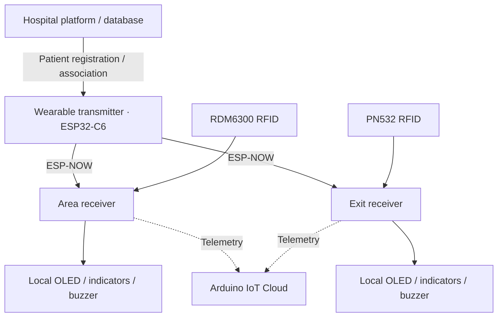

# V1 architecture

V1 is organized around one ESP32-C6 wearable transmitter and two independent receiver nodes. The wearable is the patient-side device; the receivers perform local proximity evaluation and alarms.

```mermaid
flowchart TD
    H[Hospital platform / database] -->|Patient registration / association| T[Wearable transmitter · ESP32-C6]
    T -->|ESP-NOW| A[Area receiver]
    T -->|ESP-NOW| S[Exit receiver]
    R[RDM6300 RFID] --> A
    P[PN532 RFID] --> S
    A --> O[Local OLED / indicators / buzzer]
    S --> E[Local OLED / indicators / buzzer]
    A -. Telemetry .-> C[Arduino IoT Cloud]
    S -. Telemetry .-> C
```

## Responsibility split

| Layer | Public architecture |
|---|---|
| Patient context | Registered through the hospital platform/database and associated with the wearable interface |
| Transmission | Wearable sends presence information independently to both receivers |
| Reception | Each receiver processes its own received signal locally |
| Signal processing | RSSI conditioning and state stabilization reduce short-term radio fluctuation |
| Control | Area node evaluates departure; exit node evaluates approach |
| Interaction | RFID, OLED/indicators and local acoustic alarms |
| Supervision | Arduino IoT Cloud provides telemetry visibility |

The area and exit receivers do **not** synchronize or exchange data with each other.

## Receiver evolution

The architecture above corresponds to V1. [REV 2.0](hardware-rev2.md) redesigns the receiver hardware around a removable XIAO ESP32-S3 and a custom two-layer PCB.
