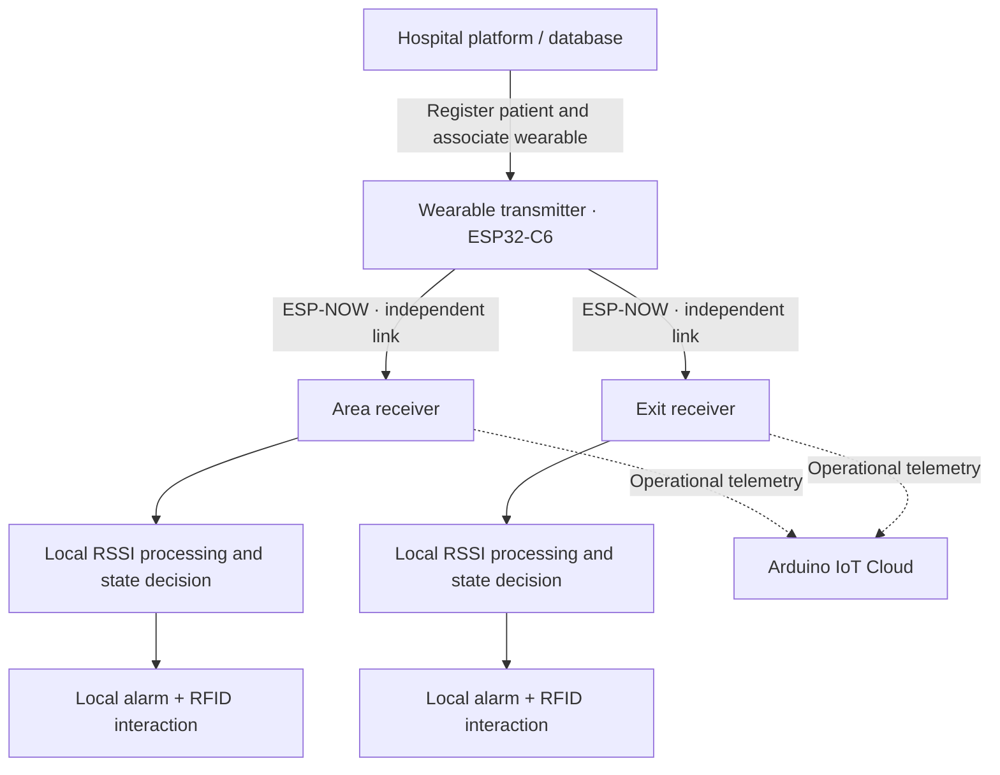

# Communication architecture

This document describes the public, block-level communication model of V1. Buildable firmware and implementation-specific constants are not distributed in the public repository.

## Data flow

## Wireless topology

The wearable is the common transmitter. It communicates separately with the area receiver and the exit receiver. The two receivers **do not exchange data, synchronize state or depend on each other** for their local decisions.

Each receiver evaluates the signal locally and applies its own state logic. The area node is responsible for detecting departure from its monitored zone, while the exit node is responsible for detecting approach to the exit.

## Local control

RSSI is used as the proximity input and is conditioned before state evaluation. Hysteresis/confirmation logic is used to reduce unstable transitions caused by radio fluctuations. Exact coefficients, thresholds, timing parameters and internal implementation details are intentionally omitted from the public portfolio.

RFID is an interaction input for the local workflows; it is not the proximity sensor.

## Cloud and hospital platform

The hospital platform/database is used to register and associate patient information with the wearable interface. Arduino IoT Cloud was used as a separate telemetry layer for receiver-state visibility.

Local alarm decisions remain receiver-side rather than depending on cloud availability.
