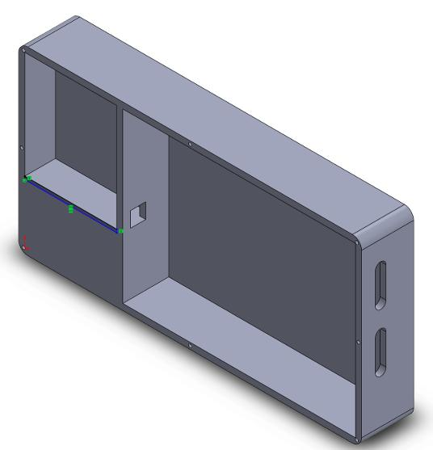
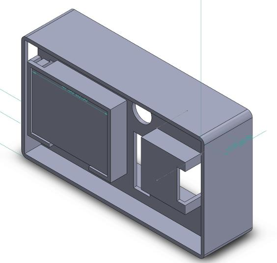
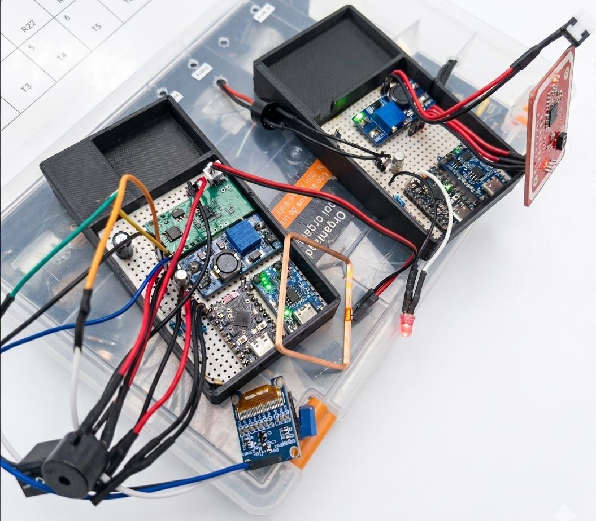
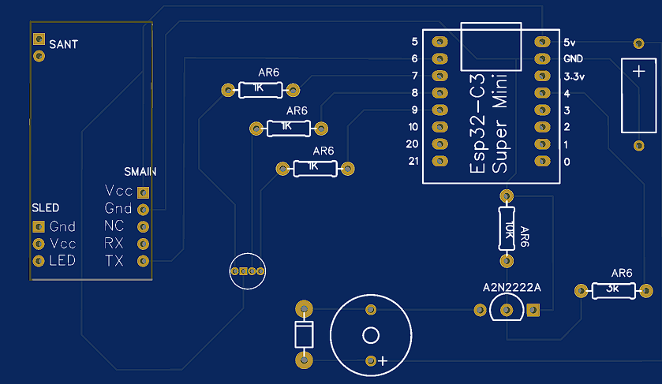
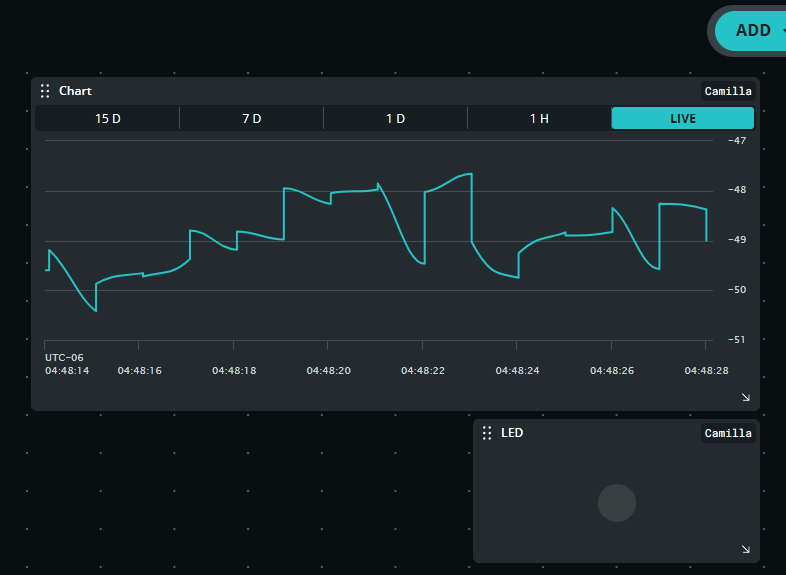
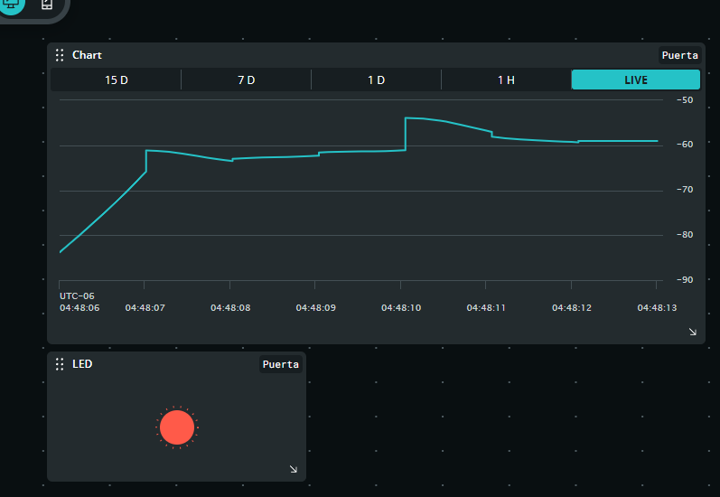

# Evidencia visual y procedencia

Las cuatro fotografías originales en `docs/images/` se conservan con sus nombres y archivos intactos. Las seis imágenes de `docs/images/report/` se extrajeron del informe final del autor sin redibujarlas. Las páginas indicadas corresponden a la numeración impresa.

## Diseño mecánico

| Base del nodo de salida | Sección intermedia del nodo de área |
|---|---|
|  |  |

Figuras 17 y 18, p. 44. Documentan distribución mecánica y trabajo CAD en SolidWorks. No sustituyen archivos editables, planos acotados ni validación de tolerancias.

## Integración electrónica

Figura 28, p. 51. Muestra el ensamble interno, placas perforadas, módulos y cableado. Es evidencia de integración física; no demuestra fabricación de la PCB mostrada en las vistas de diseño.

## Diseño de PCB

Figura 12, p. 40. La huella visible está rotulada ESP32-C3 Super Mini. La documentación del sistema identifica ESP32-C6; se mantiene explícita esta diferencia. Esta vista es una referencia histórica del diseño, **no un archivo listo para fabricar**.

## Telemetría

| Área | Salida |
|---|---|
|  |  |

Figuras 41 y 42, pp. 75 y 76. Ilustran visualización de RSSI y estado de alarma en Arduino IoT Cloud. Son capturas de interfaz; no permiten reconstruir tiempos de respuesta, número de pruebas o precisión.

## Fuente y selección

*Sistema de monitoreo de presencia y alarma local en camilla hospitalaria*, informe de residencia profesional, Luis Alejandro Pérez Sousa, ITSC, portada junio de 2026. Se seleccionaron figuras técnicas del desarrollo y los resultados. No se publican los anexos completos, credenciales, documentos personales ni capturas de infraestructura interna.

## Renders REV 2.0

[Perspectiva](images/rev2/pcb-perspective.png) · [Superior](images/rev2/pcb-top.png) · [Inferior](images/rev2/pcb-bottom.png).

Exportaciones EasyEDA suministradas por el autor, conservadas sin alterar su contenido. Muestran diseño CAD; no acreditan fabricación ni ensamble. XIAO y PN532 no aparecen montados. [Procedencia y hashes](../hardware/rev2/artifacts.json).
