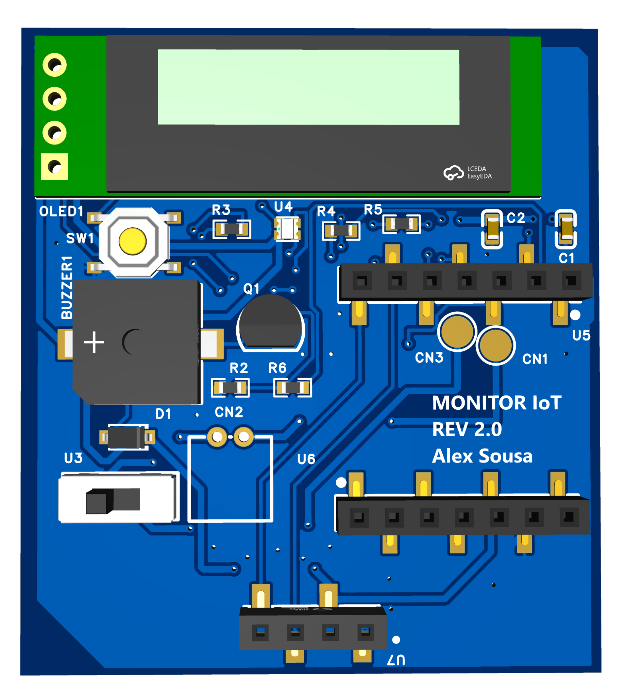

# Hardware REV 2.0

Rediseño del receptor MONITOR IoT alrededor de una XIAO ESP32-S3 removible. Los archivos publicados documentan el diseño; no acreditan una placa fabricada o probada.

## Bloques e interfaces

| Elemento | Diseño documentado |
|---|---|
| XIAO ESP32-S3 | Controlador previsto; sockets U5/U6 de siete contactos, USB accesible en borde |
| OLED1 | HS91L02W2C01, interfaz SDA/SCL y alimentación 3V3; el reporte JLCPCB identifica 128×32 |
| PN532 | Módulo externo previsto, conectado mediante U7 de cuatro contactos: GND, 3V3, SDA, SCL |
| BUZZER1 / Q1 / D1 | Buzzer con etapa NPN BC547 y diodo 1N4148W |
| U4 / R3–R5 | LED RGB con resistencias de 330 Ω |
| SW1 | Pulsador de interacción local |
| CN2 / U3 | Conector PH de dos contactos e interruptor SS12D00G4 en la interfaz de batería |
| CN1 / CN3 | Contactos pogo BAT− / BAT+; dimensiones y compresión declaradas como revisadas por el autor |
| C1 / C2 | Desacoplo de 100 nF y 10 µF |

La ausencia de un modelo 3D no determina si el fabricante suministrará una pieza. Ese alcance depende de la selección BOM, compatibilidad, disponibilidad y servicio de ensamble.

## PCB y routing

Los Gerbers contienen cobre superior e inferior, máscaras, serigrafía y archivos de taladros PTH y vías. Los renders muestran rellenos de cobre y vías adicionales. La intención de diseño es usar GND en los planos y conectar ambas caras mediante stitching vias; la conectividad completa requiere contrastar el proyecto editable y el DRC de esta misma exportación.

El criterio acordado de routing es 0.254 mm para señales y 0.5 mm para alimentación/batería. Es un criterio de diseño, no un cálculo documentado de corriente máxima. Debe contrastarse con las pistas reales y las reglas del fabricante. El espesor de cobre y el acabado deben quedar registrados en la orden definitiva.

[Vista inferior](images/rev2/pcb-bottom.png) · [Paquete de archivos](../hardware/rev2/README.md).

## Preparación de PCBA

El reporte JLCPCB suministrado es un resultado de matching para cinco placas, no prueba de fabricación:

- U3: sin pieza seleccionada.
- CN1/CN3: cantidad cero en el reporte; confirmar si serán suministro/montaje manual.
- R2, R3–R5 y R6: coincidencias marcadas como no confirmadas.
- BUZZER1: la referencia seleccionada y el nombre de huella no coinciden literalmente; comprobar dimensiones y pads con el datasheet antes de aceptar la sustitución.
- No se incluye CPL/Pick and Place independiente. Su revisión debe comprobar cara, posición y rotación por designador.
- XIAO y PN532: módulos previstos para instalación por el autor. Confirmar el alcance final del resto de componentes antes de publicar una BOM cerrada.

Las cantidades de compra del reporte pueden incluir mínimos o excedentes; no deben interpretarse como cantidad por placa.

## Conciliación antes de liberar

1. Unificar la identificación REV 2.0: el cajetín del esquema individual todavía dice V1.0.
2. Verificar el mapeo U1–U5: U1 rotula D4/SDA, D5/SCL y D6/Bb, mientras U5 asigna sus contactos 5/6/7 a Bb/SDA/SCL. Resolver con numeración física de sockets y configuración de firmware; no afirmar equivalencia sin comprobarla.
3. Conciliar OLED: V1 configura 128×64 en firmware y el matching REV 2.0 identifica 128×32.
4. Completar selección de piezas, montaje manual, CPL y revisión del Gerber/NC Drill.
5. Registrar DRC y pruebas correspondientes a esta revisión concreta.

## Bring-up propuesto — no ejecutado

Comenzar con inspección de montaje, orientación y continuidad sin alimentación. Comprobar ausencia de cortos entre rieles y GND. Energizar con limitación de corriente y registrar tensiones/consumo. Probar XIAO, OLED, pulsador, RGB, buzzer y PN532 por separado antes de integrar comunicaciones. Evaluar batería/carga, reinicios y pérdida de enlace. Guardar revisión de PCB, firmware, instrumento, condiciones y resultado de cada prueba.

[Registro de validación](validation.md). La carcasa y la validación mecánica completa se documentarán cuando existan planos y ensamble físico.
