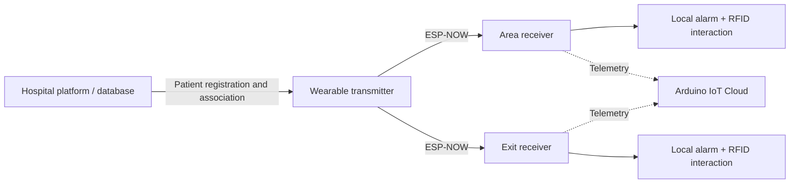

# Firmware architecture

The V1 firmware is documented publicly at **block level**. The complete source implementation is intentionally not distributed in this repository.

## System split

The wearable communicates with each receiver **independently**. The area and exit receivers do not exchange data and do not synchronize state with each other.

## Public node documentation

| Node | Public logic |
|---|---|
| [Wearable transmitter](transmitter/README.md) | Patient interface, wireless transmission and independent receiver links |
| [Area receiver](area_node/README.md) | Signal processing, state evaluation, local alarm, RFID interaction and telemetry |
| [Exit receiver](exit_node/README.md) | Approach evaluation, local alarm, RFID interaction, telemetry and re-arm |

## Source availability

The public portfolio intentionally omits buildable firmware, GPIO assignments, device identifiers, exact thresholds, timing constants and implementation-specific control parameters. The complete V1 firmware is maintained privately.

This documentation is intended to show the embedded-system architecture, responsibility split and control flow without publishing the full implementation.
