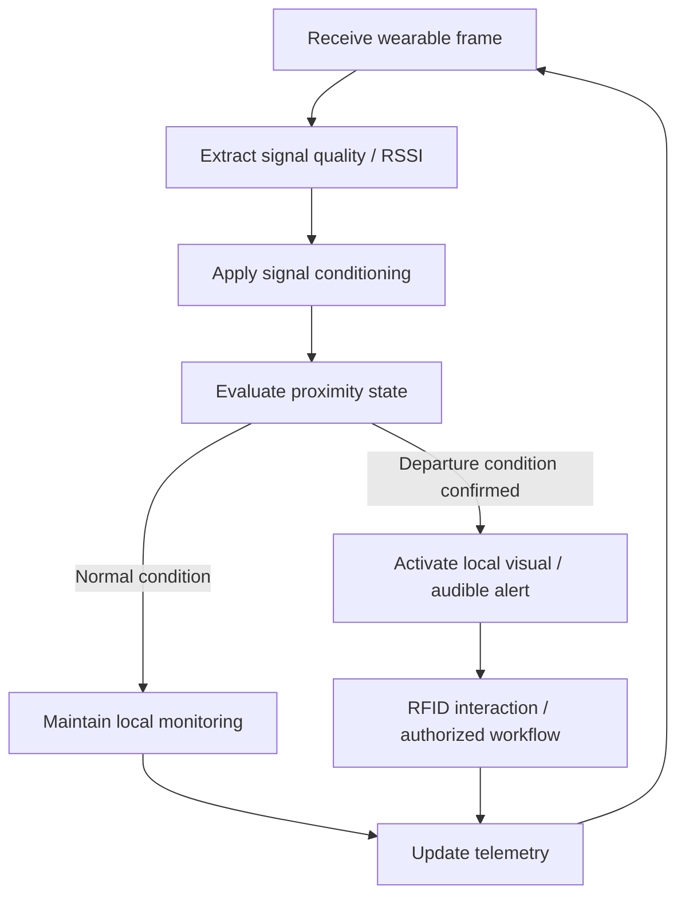

# Area receiver — firmware logic

**Platform:** ESP32-C6 (V1)

The area receiver evaluates whether the wearable remains inside the monitored zone and performs the corresponding local alert actions.

## Responsibility

- Receive the wearable signal independently from the exit receiver.
- Condition the RSSI input to reduce short-term fluctuations.
- Evaluate the local area state with hysteresis/state logic.
- Drive OLED/indicator/buzzer behavior locally.
- Process RFID interaction for the area workflow.
- Publish operational telemetry to Arduino IoT Cloud.

Exact thresholds, filter coefficients, GPIO assignments, timers and source code are intentionally not published.
