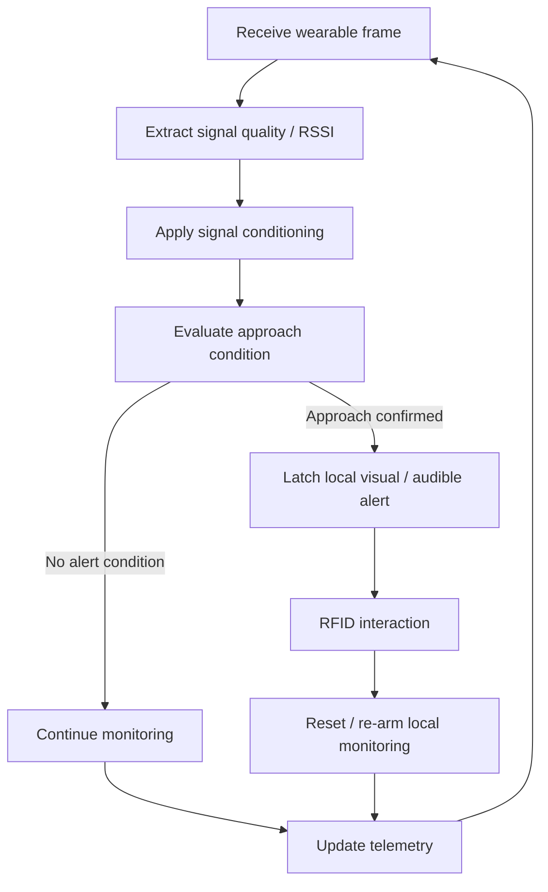

# Exit receiver — firmware logic

**Platform:** ESP32-C6 (V1)

The exit receiver independently evaluates the wearable as it approaches the monitored exit and activates its own local alarm workflow.

## Responsibility

- Receive the wearable signal independently from the area receiver.
- Evaluate approach to the exit using local RSSI/state logic.
- Activate the exit node's own visual and audible alert.
- Handle RFID interaction and local re-arm behavior.
- Publish operational telemetry to Arduino IoT Cloud.

Exact thresholds, filter coefficients, GPIO assignments, timers and source code are intentionally not published.
