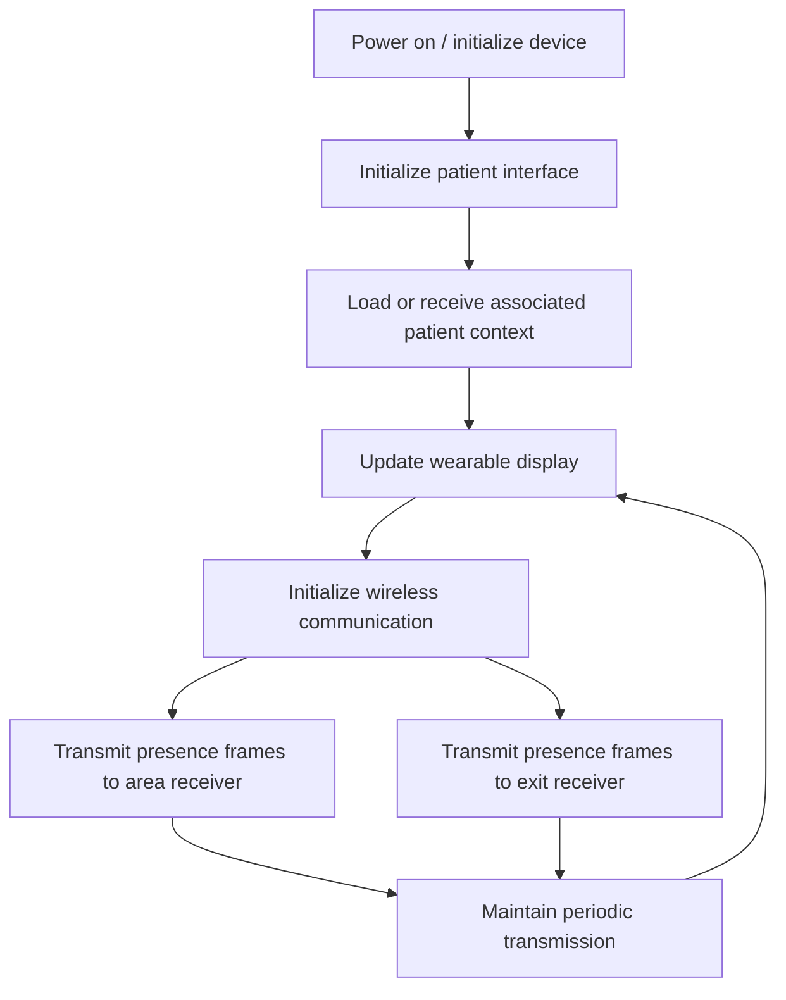

# Wearable transmitter — firmware logic

**Platform:** ESP32-C6 (V1)

The wearable is the patient-side transmitter and includes the user interface used to display the information associated with the patient registered through the hospital platform.

## Responsibility

- Present the patient-associated information on the wearable interface.
- Maintain the patient-side wireless presence signal.
- Communicate independently with the area and exit receivers.
- Avoid receiver-to-receiver coordination; each receiver evaluates the wearable locally.

Implementation-specific values, MAC addresses, channel-management details, timing constants and source code are intentionally not published.
